# How to send Microsoft Teams notifications on DAG's status

As stated in [how to send email notifications](/docs/how-tos/airflow/send-emails), Airflow allows multiple ways to inform users about DAGs and tasks status.

Furthermore, it's important to understand Airflow handles these 4 status (`failure`, `retry`, `success` and `missed SLA`) via callbacks. You can learn more about them [here](https://airflow.apache.org/docs/apache-airflow/2.2.1/logging-monitoring/callbacks.html).

## Prepare the Microsoft side

Sending messages through Teams is done using Power Automate webhooks. These connections can be assigned to Teams channels, chats, or individuals.  It is a simple two step automation: a webhook receives the DAG notification, and an action posts it to your Teams.

Everything on the Microsoft side is managed through their [Power Automate](https://make.powerautomate.com/) application.  Choose `My flows` from the sidebar:

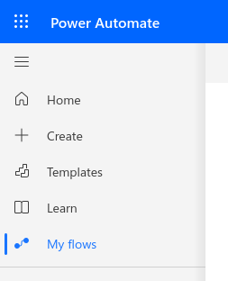

Choose `Instant cloud flow` from the `New flow` dropdown:

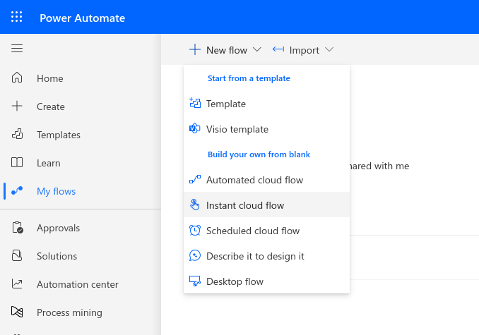

Now pick the type of trigger to use.  `When a Teams webhook request is received`:

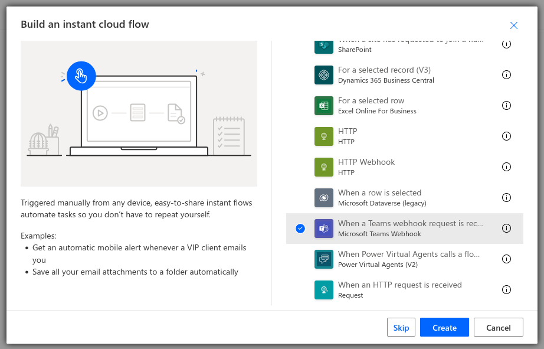

This will create a flowchart with just the webhook on it.  Click on it to bring up a sidebar with its settings.  Make sure it is set to allow anyone to trigger the flow.  Also note the empty URL field here; we will have to come back for it after the flow is saved.  You can name this flow at any time by clicking on the title text (shown here as `Untitled flow`).

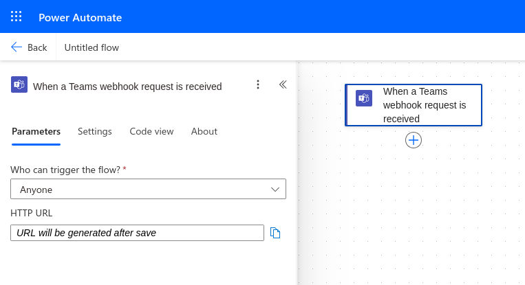

Then, click the (+) on the flowchart to add an action.  Type `card` into the search box to narrow the results, then choose `Post card in a chat or channel`:

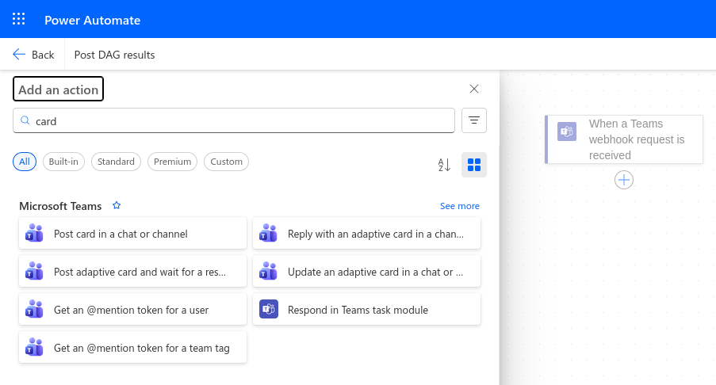

The settings for this action determine where your notification will go.  First, paste the following into the `Adaptive Card` field; this tells the workflow how to read the notifications:
- `@triggerBody()?['attachments'][0]?['content']` 

Then set `Post In` to `Chat with Flow bot` to message only yourself, or for group messages, `Group chat` or `Channel`.  For the latter two, there are more fields to set the exact destination.

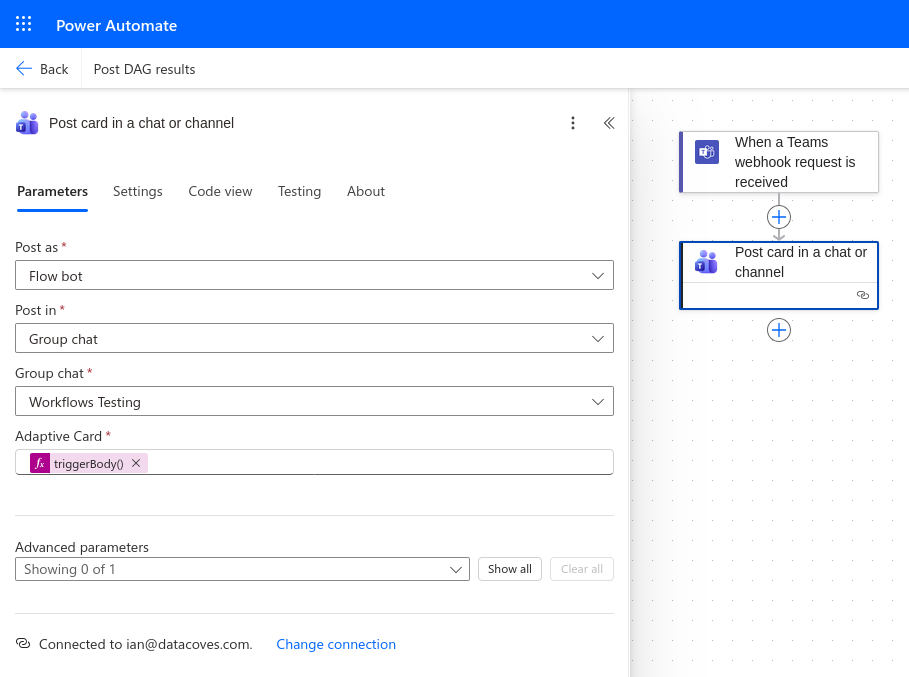

Now click Save in the upper right corner of the screen, and when it finishes, you can return to the webhook's sidebar and copy the URL it's generated.  Make sure to copy all of it.

:::info
Store this URL in a safe place as you will need it in a subsequent step and anyone with this link can send notifications to that Teams channel.
:::

## Prepare Airflow
### Create a new Integration

In Datacoves, create a new integration of type `MS Teams` by navigating to the Integrations admin page.

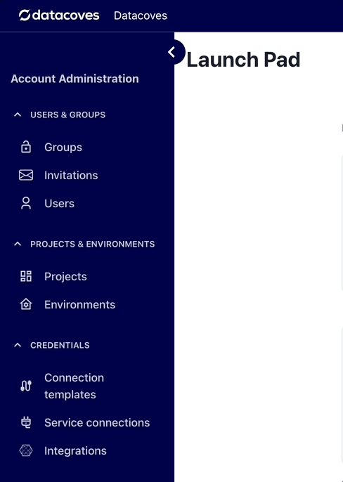

Click on the `+ New integration` button.

Provide a name and select `MS Teams`.

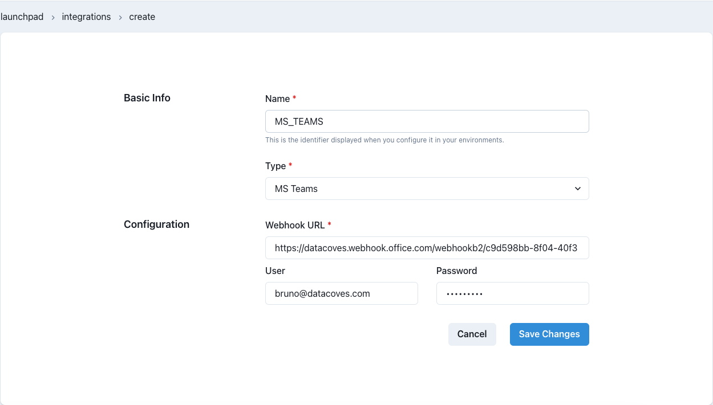

Provide the required details and `Save` changes.

:::note
The name you specify will be used to create the Airflow-Teams connection. It will be uppercased and joined by underscores -> `'ms teams'` will become :::
:::
`MS_TEAMS`. You will need this name below.

### Add integration to an Environment

Once the `MS Teams` integration is created, it needs to be associated with the Airflow service within a Datacoves environment.

Go to the `Environments` admin screen.


Select the Edit icon for the environment that has the Airflow service you want to configure and click on the `Integrations` tab.

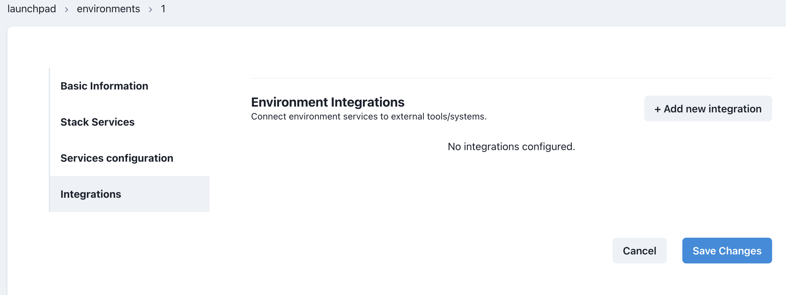

Click on the `+ Add new integration` button and select the integration you created previously. In the second dropdown select `Airflow` as the service.

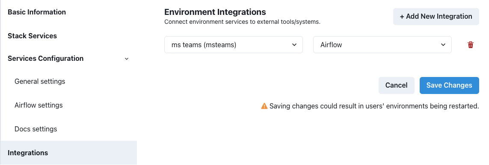

`Save` changes. The Airflow service will be restarted and will include the Teams configuration required to send notifications.

## Implement DAG

Once MS Teams and Airflow are configured, you can start using the integration within Airflow Callbacks to send notifications to your MS Teams channel.

MS Teams will receive a message with a 'View Log' link that users can click on and go directly to the Airflow log for the Task.

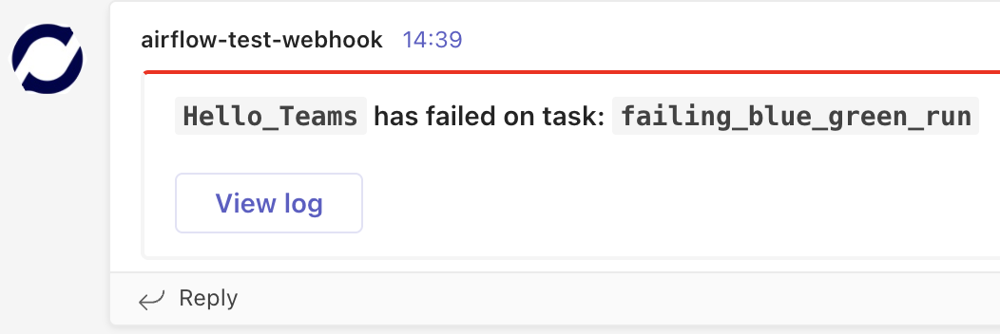

### Callback Configuration

In the examples below, we will send a notification on failing tasks or when the full DAG completes successfully using our custom callbacks: `inform_failure` and `inform_success`.

:::note
In addition to `inform_failure` and `inform_success`, we support these callbacks `inform_failure`, `inform_success`, `inform_retry`, `inform_sla_miss`.
:::

To send MS Teams notifications, in the Airflow DAG we need to import the appropriate notifier and use it with the following parameters:

- `connection_id`: the name of the Datacoves Integration created above
  - if no connection_id is specified, MSTeams Notifier will use `ms_teams`
- `message`: the body of the message
- `theme_color`: theme color of the MS Teams card.  This may be one of:
  - `default`
  - `emphasis`
  - `good`
  - `attention`
  - `warning`
  - `accent`

:::info
`on_failure_callback` will throw an error if using lists causing your task to fail.
:::

### Python version

```python
from pendulum import datetime
from airflow.decorators import dag, task
from notifiers.datacoves.ms_teams import MSTeamsNotifier

@dag(
    default_args={
        "start_date": datetime(2024, 1, 1),
        "owner": "Noel Gomez",
        "email": "gomezn@example.com",
        "email_on_failure": True,
    },
    description="Sample DAG with MS Teams notification",
    schedule="0 0 1 */12 *",
    tags=["version_2", "ms_teams_notification", "blue_green"],
    catchup=False,
    on_success_callback=MSTeamsNotifier(
        connection_id="MS_TEAMS",  # ✅ If using 'ms teams' as an Integration, this is optional
        message="DAG {{ dag.dag_id }} Succeeded"
    ),
    on_failure_callback=MSTeamsNotifier(message="DAG {{ dag.dag_id }} Failed"),
)
def dbt_run():

    @task.datacoves_dbt(connection_id="main")  
    def transform():
        return "dbt run -s personal_loans"

    transform() 

dag = dbt_run()
```

:::note
Quotation marks are not needed when setting the custom message. However, making use of Jinja in a YAML file requires the message to be wrapped in quotations to be parsed properly. eg) `{{ dag.dag_id }} failed`
:::

### YAML version

```yaml
description: "Sample DAG with MS Teams notification"
schedule: "0 0 1 */12 *"
tags:
  - version_2
  - ms_teams_notification
default_args:
  start_date: 2024-01-01
  owner: Noel Gomez
  # Replace with the email of the recipient for failures
  email: gomezn@example.com
  email_on_failure: true
catchup: false

# Optional callbacks used to send MS Teams notifications
notifications:
  on_success_callback:
    notifier: notifiers.datacoves.ms_teams.MSTeamsNotifier
    args:
      connection_id: MS_TEAMS
      message: "DAG {{ dag.dag_id }} Succeeded"
  on_failure_callback:
    notifier: notifiers.datacoves.ms_teams.MSTeamsNotifier
    args:
      connection_id: MS_TEAMS
      message: "DAG {{ dag.dag_id }} Failed"
      color: "warning"

# DAG Tasks
nodes:
  transform:
    operator: operators.datacoves.dbt.DatacovesDbtOperator
    type: task

    bash_command: "dbt run -s personal_loans"
```

## Getting Started Next Steps

Start [developing DAGs](/docs/getting-started/admin/creating-airflow-dags)
