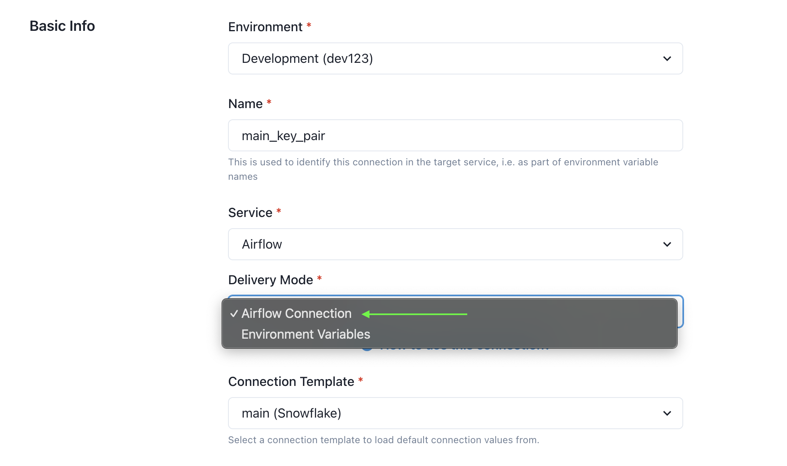
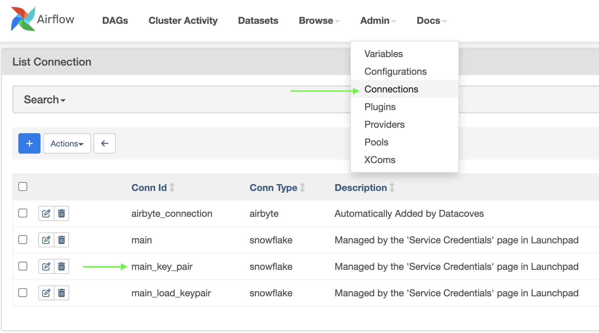

# Using Key-Pair Authentication in Airflow

:::note
This documentation will presume you have knowledge of Datacoves' [Service Connections](/how-tos/datacoves/how_to_service_connections.md) and how to configure them.
:::

Using RSA Keys is only supported through Airflow Connections, not Environment Variables. Make sure your Datacoves Service Connection is using this `delivery mode`.



Also, make sure to select `Authentication mechanism: RSA Key-pair` and [assign the generated key to your Snowflake user](https://docs.snowflake.com/en/user-guide/key-pair-auth#assign-the-public-key-to-a-snowflake-user).


Once you have properly configured your Service Connection, your Airflow instance will restart. This process may take up to 10 minutes.

To confirm the above worked correctly, you can access your Airflow `Admin -> Connections` menu, and make sure your Service Connection  is now an Airflow Connection.



## Usage

Thanks to our new [`dbt` Airflow Decorator](/reference/airflow/datacoves-decorators.md), you can run dbt against your warehouse using the Airflow Connection you just created, by simply passing the Service Connection name to our decorator's `connection_id` parameter.


```python
@dag(
    [...]
)
def dbt_dag():

    @task.datacoves_dbt(
        connection_id="main_key_pair" # your service connection name
    )
    def run_dbt():
        return "dbt debug" # return any dbt command

    run_dbt()

dbt_dag()
```