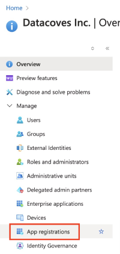

import Tabs from '@theme/Tabs';
import TabItem from '@theme/TabItem';

# How to Clone with Azure DevOps

To enable Datacoves cloning from Azure DevOps, you must complete a series of steps outlined in this guide.

<Tabs>
  <TabItem value="create-app" label="1. Create your Application" default>
    <!-- Anchor for linking -->
    
    ## Step 1: Create your Application

    If you do not have an Entra ID application created, follow these steps:

    **Step 1**  
    - From your [Azure Portal](https://portal.azure.com), search for EntraID.

    **Step 2**  
    - Select `App Registrations` from the left navigation menu.

    

    **Step 3**  
    - Select `+ New registration` and fill out the fields:
      - **Name:** Give your application a meaningful name
      - **Supported account types:** Select `Accounts in this organizational directory only`

    **Step 4**  
    - Click **Register**

    
  </TabItem>

  <TabItem value="add-user" label="2. Add your Application as a User in the DevOps Portal">
    <!-- Anchor for linking -->
    
    ## Step 2: Add your Application as a User in DevOps Portal

    **Step 1**  
    - Sign in to your [Azure DevOps Portal](https://dev.azure.com) and click `Organization settings` at the bottom of the left navigation.

    

    **Step 2**  
    - Select `Users` in the left navigation menu.

    

    **Step 3**  
    - Select `Add Users` to add the application to the user list.

    

    **Step 4**  
    - Set the user as the application you created above and give it Basic Access.

    

    **Step 5**  
    - Select the project you wish to add the application to using the `Add to projects` dropdown, and select the `Send email invites` checkbox.

    

    ✅ Now that you have created your EntraID application and added it as a user in the DevOps Portal, proceed to the next tab to configure **Azure DevOps authentication**.
  </TabItem>

  <TabItem value="auth-details" label="3. Gather DevOps Authentication details">
    <!-- Anchor for linking -->
    
    ## Step 3: Gather DevOps Authentication Details

    You will need to gather the following application information to configure your project to use Azure DevOps for cloning.

    ### Application (Client) ID and Directory (Tenant) ID

    **Step 1**  
    - From your [Azure Portal](https://portal.azure.com), search for EntraID.

    **Step 2**  
    - Select `App Registrations` from the left navigation menu.

    

    **Step 3**  
    - Select `All Applications` and select your newly created app.

    **Step 4**  
    - Copy your Application (Client) ID and Directory (Tenant) ID.

    

    ### Repo SSH and HTTP URLs

    **Step 1**  
    - Log in to your [Azure DevOps Portal](https://dev.azure.com).

    **Step 2**  
    - Navigate to your project.

    **Step 3**  
    - Navigate to your repo and select the `Clone` button.

    **Step 4**  
    - Copy **both** the SSH **and** HTTP URLs and enter them in the appropriate fields in the project setup screen in Datacoves.

    

    ✅ Be sure to save all of these details in a safe notepad. Proceed to the next tab to configure **Azure DevOps authentication**.
  </TabItem>

  <TabItem value="authenticate" label="4. Authenticate Azure DevOps">
    <!-- Anchor for linking -->
    
    ## Step 4: Authenticate Azure DevOps

    Now you are ready to begin configuring your authentication method. This is the method Datacoves will use to clone your repo from Azure DevOps. You have two options: `secrets` and `certificates`.

    **Step 1**  
    - Navigate back to the tab where you created your application in the Azure Portal. You should be inside your newly created application.  
    - Select the `Certificates & Secrets` option in the left navigation menu.

    

    ### Secret or Certificate Authentication Method

    As mentioned above, you have two authentication methods available: `secrets` or `certificates`. Please select one to continue.

    ### Secret-Based Authentication

    **Step 2**  
    - Select `Client Secrets` in the top navigation menu and `+ New Secret`.

    **Step 3**  
    - Give it a meaningful description and set your desired expiration date.

    **Step 4**  
    - Copy the Value onto a notepad.

    

    ✅ Congrats, you are now ready to proceed to project configuration steps.

    ### Certificate-Based Authentication

    🚨 This configuration requires some back and forth between Azure DevOps and Datacoves.

    **Step 2**  
    - Select `Certificates` from the top navigation menu.

    

    **Step 3**  
    - To generate a certificate PEM file, begin project configuration.

    **Step 4**  
    - Select `Azure DevOps Certificate` as your Cloning Strategy. 

    

    **Step 5**  
    - Copy the certificate and save it as a plain text file on your desktop with a `.pem` extension `datacoves_cert.pem`.

    

    **Step 6**  
    - Navigate back to your Azure Portal tab and select `Upload certificate`. Upload the PEM file you saved in the previous step.

    

    **Step 7**  
    - Give it a description and select `Add`.
  </TabItem>
</Tabs>
