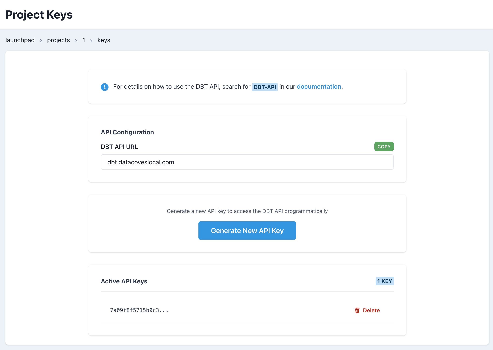

# How to Query Worker Usage Minutes via API

This guide explains how to use the Datacoves Billing API to retrieve worker usage minutes for your environment.

## API Endpoints

### List All Environments Usage

```
GET https://api.cluster-domain.com/api/v1/billing/
```

Returns usage data for all environments accessible to your account.

### Get Specific Environment Usage

```
GET https://api.cluster-domain.com/api/v1/billing/{env-slug}/
```

Returns usage data for a specific environment.

#### Path Parameters

| Parameter | Type | Required | Description |
|-----------|------|----------|-------------|
| `env-slug` | string | Yes | The slug identifier for your environment |

### Query Parameters

| Parameter | Type | Required | Default | Description |
|-----------|------|----------|---------|-------------|
| `start_date` | string (YYYY-MM-DD) | No | Today's date | The start date for the usage period |
| `end_date` | string (YYYY-MM-DD) | No | Today + 30 days | The end date for the usage period |
| `service` | string | No | All services | Filter by service type: `airflow`, `airbyte`, or `unknown` |

## Response Format

The API returns an array of usage records with the following fields:

| Field | Type | Description |
|-------|------|-------------|
| `environment_slug` | string | The environment identifier |
| `service` | string | The service type: `airflow`, `airbyte`, or `unknown` |
| `date` | datetime | The timestamp of the usage record |
| `amount_minutes` | integer | The number of minutes used |

### Example Response

```json
[
  {
    "environment_slug": "my-env",
    "service": "airflow",
    "date": "2025-11-15T10:30:00Z",
    "amount_minutes": 120
  },
  {
    "environment_slug": "my-env",
    "service": "airbyte",
    "date": "2025-11-15T14:20:00Z",
    "amount_minutes": 60
  }
]
```

## Usage Examples

### Example 1: Get All Environments Usage

Query usage for all environments:

```bash
curl -X GET "https://api.cluster-domain.com/api/v1/billing/?start_date=2025-11-01&end_date=2025-11-30" \
  -H "Authorization: Token YOUR_API_KEY"
```

### Example 2: Get Specific Environment Usage

Query usage for a specific environment for November 2025:

```bash
curl -X GET "https://api.cluster-domain.com/api/v1/billing/my-env/?start_date=2025-11-01&end_date=2025-11-30" \
  -H "Authorization: Token YOUR_API_KEY"
```

### Example 3: Get Today's Usage

Query usage for today only (using default dates):

```bash
curl -X GET "https://api.cluster-domain.com/api/v1/billing/my-env/" \
  -H "Authorization: Token YOUR_API_KEY"
```

### Example 4: Get Custom Date Range

Query usage for a specific week:

```bash
curl -X GET "https://api.cluster-domain.com/api/v1/billing/my-env/?start_date=2025-11-01&end_date=2025-11-07" \
  -H "Authorization: Token YOUR_API_KEY"
```

### Example 5: Filter by Service

Query usage for Airflow only:

```bash
curl -X GET "https://api.cluster-domain.com/api/v1/billing/my-env/?service=airflow&start_date=2025-11-01&end_date=2025-11-30" \
  -H "Authorization: Token YOUR_API_KEY"
```

### Example 6: Python Script

Use the API in a Python script to analyze usage:

```python
import requests
from datetime import datetime, timedelta

API_URL = "https://api.cluster-domain.com/api/v1"
API_KEY = "your_api_key_here"
ENV_SLUG = "my-env"

def get_worker_usage(env_slug=None, start_date=None, end_date=None, service=None):
    """
    Retrieve worker usage minutes for an environment or all environments.
    
    Args:
        env_slug (str, optional): Environment slug. If None, returns data for all environments
        start_date (str, optional): Start date in YYYY-MM-DD format
        end_date (str, optional): End date in YYYY-MM-DD format
        service (str, optional): Filter by service type (airflow, airbyte, unknown)
    
    Returns:
        list: Usage records
    """
    if env_slug:
        url = f"{API_URL}/billing/{env_slug}/"
    else:
        url = f"{API_URL}/billing/"
    
    params = {}
    if start_date:
        params['start_date'] = start_date
    if end_date:
        params['end_date'] = end_date
    if service:
        params['service'] = service
    
    response = requests.get(
        url=url,
        headers={"Authorization": f"Token {API_KEY}"},
        params=params
    )
    
    response.raise_for_status()
    return response.json()

def calculate_total_minutes_by_service(usage_data):
    """
    Calculate total minutes used per service.
    
    Args:
        usage_data (list): Usage records from API
    
    Returns:
        dict: Total minutes per service
    """
    totals = {}
    for record in usage_data:
        service = record['service']
        minutes = record['amount_minutes']
        totals[service] = totals.get(service, 0) + minutes
    return totals

# Example: Get last month's usage
today = datetime.now()
first_day_last_month = (today.replace(day=1) - timedelta(days=1)).replace(day=1)
last_day_last_month = today.replace(day=1) - timedelta(days=1)

start_date = first_day_last_month.strftime('%Y-%m-%d')
end_date = last_day_last_month.strftime('%Y-%m-%d')

usage = get_worker_usage(ENV_SLUG, start_date, end_date)
totals = calculate_total_minutes_by_service(usage)

print(f"Usage from {start_date} to {end_date}:")
for service, minutes in totals.items():
    hours = minutes / 60
    print(f"  {service}: {minutes} minutes ({hours:.2f} hours)")
```

## Authentication

The API requires authentication using a Datacoves API key. Include the key in the `Authorization` header:

```
Authorization: Token YOUR_API_KEY
```

### Generating an API Key

To obtain your API key:

1. Navigate to your project settings in the Datacoves admin panel
2. Go to the **Keys** section
3. Click on **Generate New API Key**



Once generated, copy and securely store your API key. It will only be shown once.

## Service Types

The API categorizes worker usage by service type:

- **airflow**: Usage from Airflow workers
- **airbyte**: Usage from Airbyte workers  
- **unknown**: Usage that couldn't be categorized

## Notes

- All dates should be in `YYYY-MM-DD` format
- If no dates are provided, the API defaults to today through 30 days from today
- The `amount_minutes` field represents the total minutes of worker usage
- Times are returned in UTC format