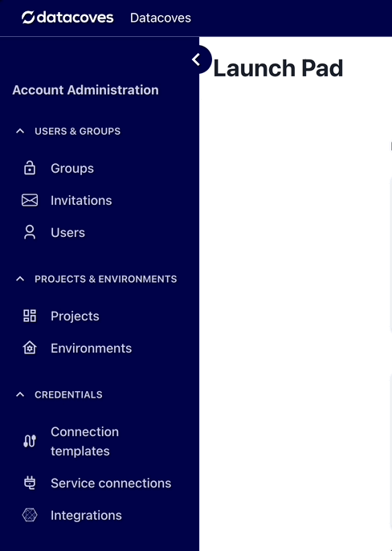
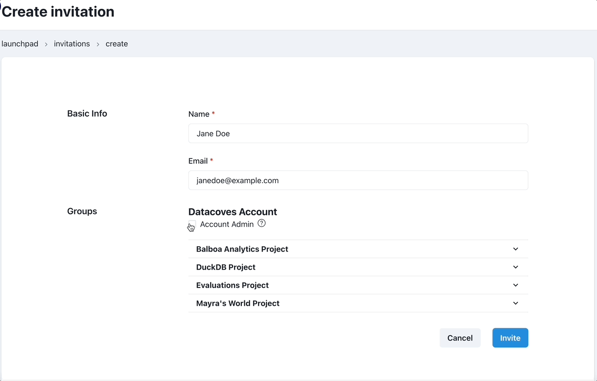

# How to Invite a User to your Account 

Navigate to the invitations page

Select the `+ invite user` button 

You will need the user's:

- Name
- Email

Using the checkboxes below you can select the Security Groups the user should belong to for Development and Production Environments

:::tip
See the [Groups](/docs/reference/admin-menu/groups) reference page for more information on Datacoves groups and their permissions.
:::

