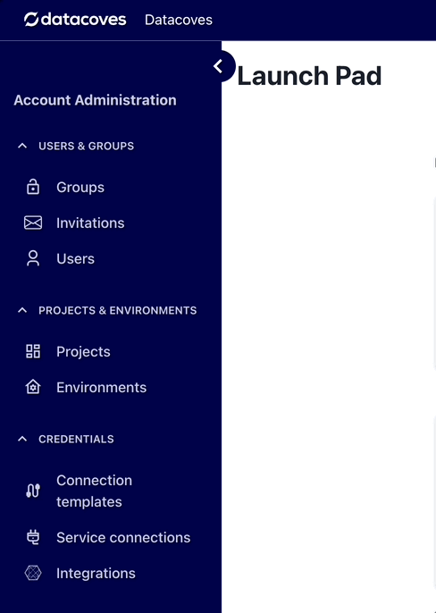
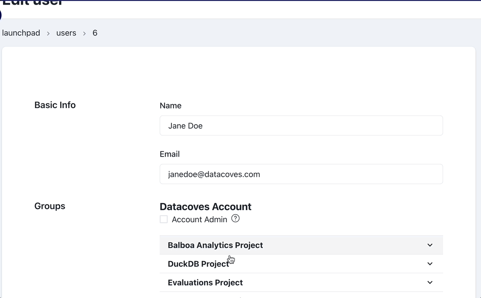
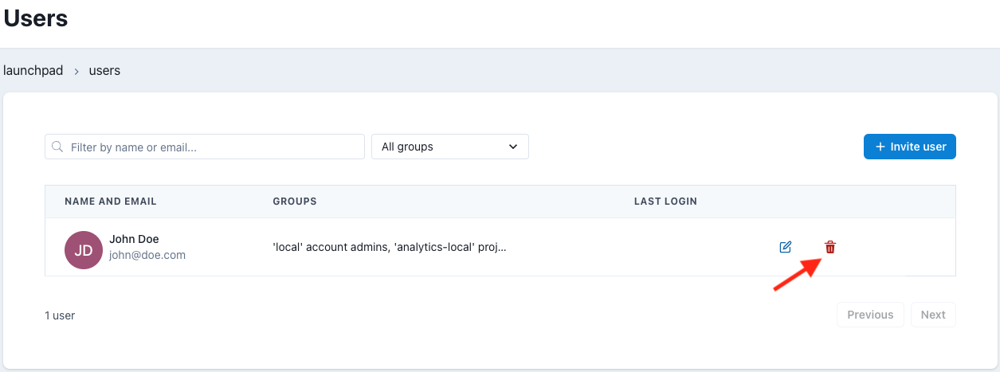

# How to Manage Users

Navigate to the Users page

## Edit a User

When you edit a user record, you can modify the users `Name`, `Email` and the assigned `Permission Groups`

:::note
Select the project to edit user access.
:::

## Delete a User

On the User listings page, clicking on the trash can will delete the user from your account.

