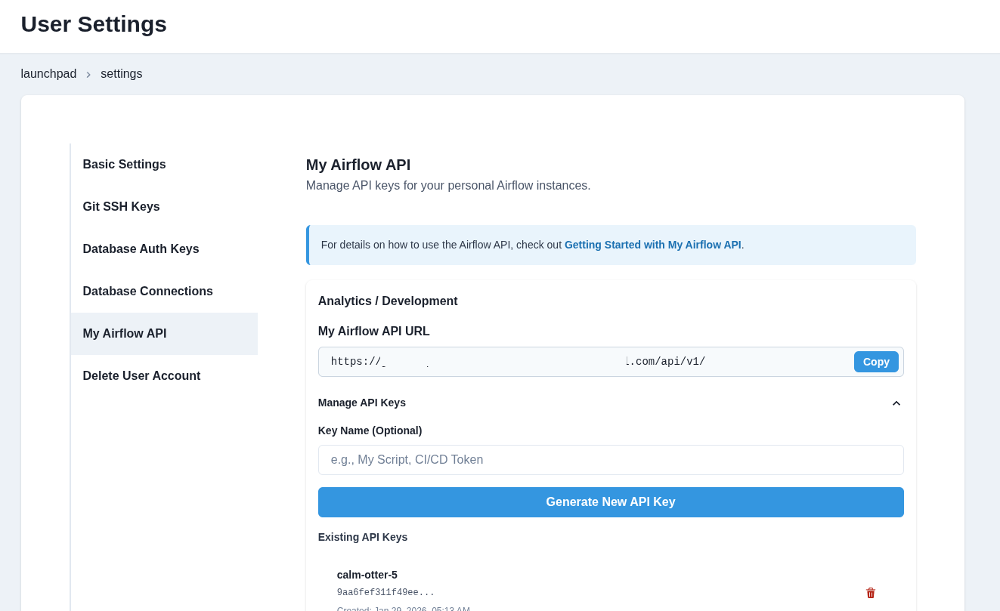

# How to use the My Airflow API

:::warning
The API allows you to view secrets values in plain text. Always exercise the principle of least privilege.
:::

This guide walks you through configuring API access for your personal My Airflow instance.

### Step 1: Navigate to User Settings

Click on your avatar in the top right corner and select `Settings`.

### Step 2: Select the My Airflow API tab

In the left sidebar, click on `My Airflow API`. You will see a list of environments where you have My Airflow enabled.



### Step 3: Copy the API URL

For your target environment, copy the `My Airflow API URL`.

### Step 4: Generate an API Key

1. Click "Manage API Keys" to expand the key management section
2. Optionally enter a name for your key (e.g., "My Script", "CI/CD Token")
3. Click "Generate New API Key"
4. Copy your API key immediately - it will not be shown again

### Step 5: Add your credentials to a .env file

Create a `.env` file inside your `orchestrate/` directory and be sure to add the file to your `.gitignore`. Add your credentials there.

```env
MY_AIRFLOW_API_URL = "https://your-slug-api-airflow-env.domain.com/api/v1/"
MY_AIRFLOW_API_KEY = "your-api-key-here"
```

### Step 6: Use it in a Python script

Below is a sample script that makes use of the Airflow API.

**This script does the following:**
- Initializes the Airflow API client using authentication details from environment variables.
- Fetches a list of all DAGs from the Airflow API.
- Prints a sorted list of DAG IDs for better readability.
- Triggers a new DAG run for a specified DAG using the API.
- Updates an Airflow dataset using the API.
- Handles API errors and retries requests if necessary.

```python
# airflow_api_call.py
import requests
import os
import json
from dotenv import load_dotenv

load_dotenv()
API_URL = os.getenv("MY_AIRFLOW_API_URL")
API_KEY = os.getenv("MY_AIRFLOW_API_KEY")

def update_dataset(name):
    url = f"{API_URL}/datasets/events"

    response = requests.post(
        url=url,
        headers={
            "Authorization": f"Token {API_KEY}",
        },
        json={"dataset_uri": "upstream_data"}
    )
    return response.json()


def trigger_dag(dag_id):
    url = f"{API_URL}/dags/{dag_id}/dagRuns"

    response = requests.post(
        url=url,
        headers={
            "Authorization": f"Token {API_KEY}",
        },
        json={"note": "Trigger from API"}
    )
    return response.json()


def list_dags():
    url = f"{API_URL}/dags"

    response = requests.get(
        url=url,
        headers={
            "Authorization": f"Token {API_KEY}",
            "Content-Type": "application/json",
        },
    )

    # Extract just the DAG names from the response
    dags_data = response.json()
    dag_names = [dag['dag_id'] for dag in dags_data['dags']]

    # Sort the names alphabetically for better readability
    dag_names.sort()
    return dag_names


def print_response(response):
    if response:
        msg = json.dumps(response, indent=2)
        print(f"Event posted successfully:\n{'='*30}\n\n {msg}")


if __name__ == "__main__":

    # Update an Airflow Dataset
    # dataset_name = "upstream_data"
    # response = update_dataset(dataset_name)
    # print_response(response)

    # Trigger a DAG
    # dag_id = "bad_variable_usage"
    # response = trigger_dag(dag_id)
    # print_response(response)

    # List DAGs
    response = list_dags()
    print_response(response)
```

:::note
Your API keys work for both My Airflow and Team Airflow (if you have access). The token is validated based on your user permissions.
:::
