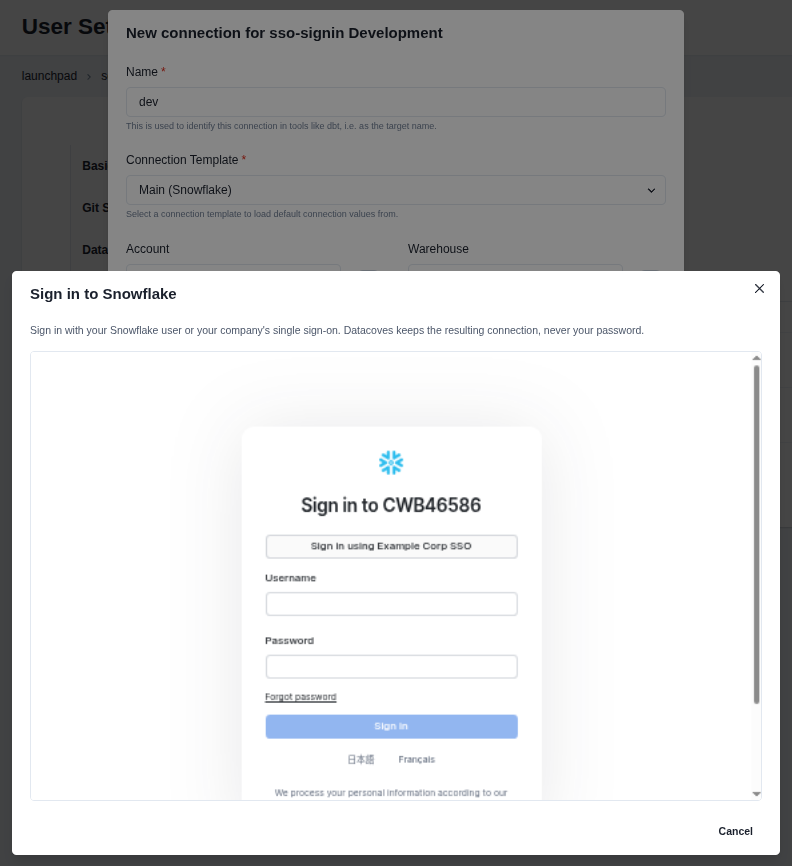
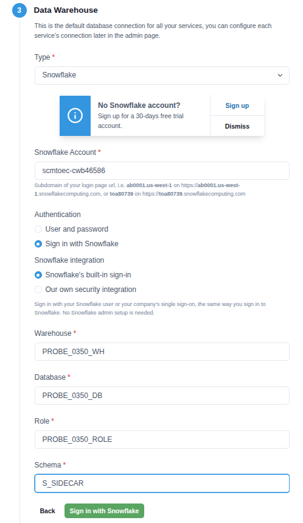
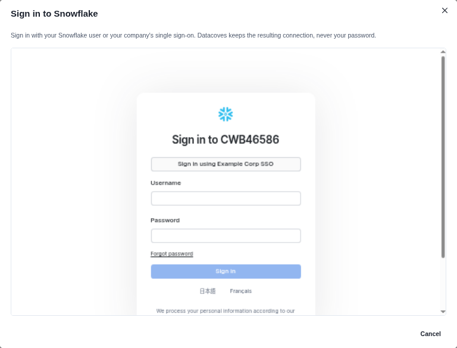
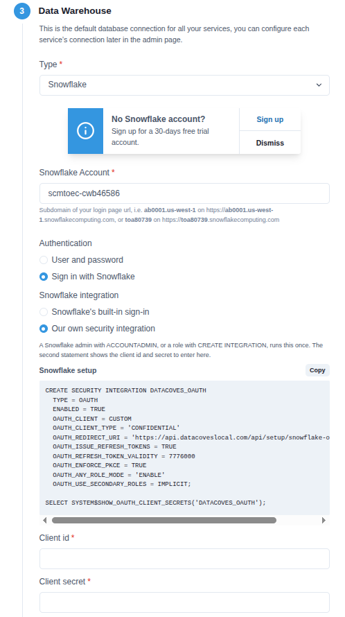

# How to sign in to Snowflake with OAuth

Datacoves connects dbt, the Snowflake extension, Datacoves Copilot and Airflow to Snowflake with a password, a
key pair, or **Sign in with Snowflake**. Sign in with Snowflake works with Snowflake users and with your
company's single sign-on, so it is the option for accounts where users have no password.

It is offered in the setup wizard, in **Settings > Database Connections** and, for Airflow, in **Service
Connections** with the Airflow Connection delivery mode. Airflow runs as the Snowflake user who signed in.



## Snowflake's built-in sign-in

Needs no Snowflake admin setup. Datacoves signs in through Snowflake's `SNOWFLAKE$LOCAL_APPLICATION`
integration. Check that your account has it:

```sql
SHOW SECURITY INTEGRATIONS LIKE 'SNOWFLAKE$LOCAL_APPLICATION';
```



The sign-in opens in a dialog in Datacoves. Sign in the way you sign in to Snowflake. Passkeys aren't available
in the dialog; pick another method, such as an authenticator app.



## Your own security integration

Use it when your admins want their own OAuth integration, with its own refresh token validity and role rules.
A Snowflake admin with `ACCOUNTADMIN`, or a role with the `CREATE INTEGRATION` privilege, runs this once.
Datacoves shows the same statements, with your cluster's redirect URI filled in and a copy button, in the
setup wizard and on the connection template form.



```sql
CREATE SECURITY INTEGRATION DATACOVES_OAUTH
  TYPE = OAUTH
  ENABLED = TRUE
  OAUTH_CLIENT = CUSTOM
  OAUTH_CLIENT_TYPE = 'CONFIDENTIAL'
  OAUTH_REDIRECT_URI = 'https://api.<your Datacoves domain>/api/setup/snowflake-oauth/callback'
  OAUTH_ISSUE_REFRESH_TOKENS = TRUE
  OAUTH_REFRESH_TOKEN_VALIDITY = 7776000
  OAUTH_ENFORCE_PKCE = TRUE
  OAUTH_ANY_ROLE_MODE = 'ENABLE'
  OAUTH_USE_SECONDARY_ROLES = IMPLICIT;

SELECT SYSTEM$SHOW_OAUTH_CLIENT_SECRETS('DATACOVES_OAUTH');
```

- `OAUTH_CLIENT = CUSTOM` and `OAUTH_CLIENT_TYPE = 'CONFIDENTIAL'` make an integration that Datacoves
  authenticates to with a client id and secret.
- `OAUTH_REDIRECT_URI` is where Snowflake sends the browser after sign-in. It is `https://api.` plus the
  domain of your Datacoves cluster, the domain in your Datacoves address, and the path above.
- `OAUTH_ISSUE_REFRESH_TOKENS` and `OAUTH_REFRESH_TOKEN_VALIDITY` let dbt and Airflow keep working without
  signing in again. The validity is in seconds: 86400 (1 day) to 7776000 (90 days). Snowflake Support raises
  the maximum on request.
- `OAUTH_ENFORCE_PKCE` requires PKCE on every sign-in.
- `OAUTH_ANY_ROLE_MODE` and `OAUTH_USE_SECONDARY_ROLES` let dbt switch roles inside a session, as it does with
  a password or a key pair.
- `SYSTEM$SHOW_OAUTH_CLIENT_SECRETS` returns the client id and secret. Enter them in the setup wizard, or on
  the connection template under **Sign in with Snowflake**. Every connection on that template then signs in
  through this integration.

Snowflake blocks `ACCOUNTADMIN`, `SECURITYADMIN`, `GLOBALORGADMIN` and `ORGADMIN` in OAuth sessions by
default. Use another role for dbt and Airflow.

## When a sign-in expires

A sign-in lasts as long as the integration's `OAUTH_REFRESH_TOKEN_VALIDITY`. When one expires, is about to
expire, or Snowflake revokes it, the Launchpad shows a banner with **Sign in again**, and the connection lists
show a badge. Signing in again restarts your workspace with the new sign-in. An Airflow service connection is
signed in again from its edit page.

Single-use refresh tokens (`OAUTH_SINGLE_USE_REFRESH_TOKENS_REQUIRED = TRUE`) are not supported. Datacoves
shows the `ALTER SECURITY INTEGRATION` statement that turns them off when it finds them.

## Workload identity for Airflow

An Airflow service connection can sign in with no secret at all: choose the Airflow Connection delivery mode
and **Workload identity (Kubernetes)** as the authentication mechanism, and Snowflake trusts your environment's
Airflow as one service user. The form shows the statement to run, with the issuer and subject of your
environment filled in:

```sql
CREATE USER AIRFLOW_SERVICE
  WORKLOAD_IDENTITY = (
    TYPE = OIDC
    ISSUER = '<issuer shown in the form>'
    SUBJECT = '<subject shown in the form>'
  )
  TYPE = SERVICE
  DEFAULT_ROLE = TRANSFORMER;

GRANT ROLE TRANSFORMER TO USER AIRFLOW_SERVICE;
```

Turn Airflow on in the environment before you create the connection, so the form can show the issuer and
subject.

## Network policies

Token requests come from Datacoves' addresses, so Snowflake network policies have to allow them. The setup SQL
panel lists the addresses when your cluster has them configured.
