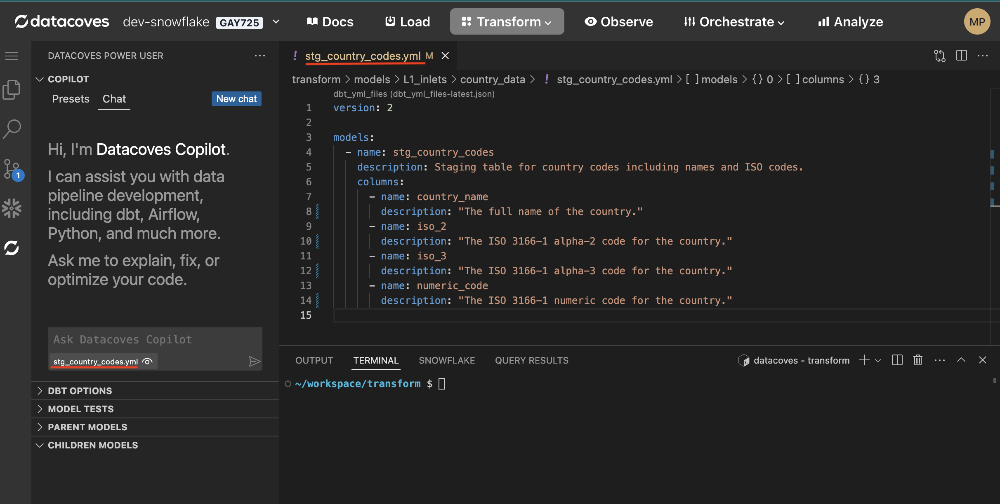
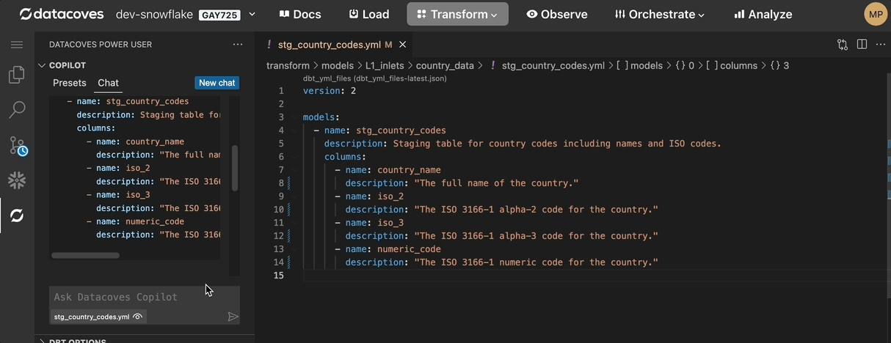

import Tabs from '@theme/Tabs';
import TabItem from '@theme/TabItem';

# Datacoves Copilot v1

This section describes how to configure and use Datacoves Copilot v1.

Datacoves Copilot v1 supports ChatGPT and Azure Open AI LLMs. Datacoves v4+ includes Datacoves Copilot 2.0 which enhances the experience and supports many more LLM providers.

## How Tos

<Tabs>
<TabItem value="config" label="Config" default>

### Configure your LLM for Datacoves Copilot v1

:::note
Datacoves Copilot v1 only support the 4o model gpt model.
:::

#### Step 1: Create a Datacoves Secret

Creating a [Datacoves Secret](/docs/how-tos/datacoves/how_to_secrets.md) requires some key fields to be filled out:

- **Name:** The secret must be named `datacoves-copilot-llm-api`
- **Description:** Provide a simple description such as: `Open AI config`
- **Format:** Select `Raw JSON`
- **Value**: The value will vary based on the LLM you are utilizing.
  - **Open AI:** You only need your API key. Head to [Open AI](https://platform.openai.com/api-keys) to create your key. `{"OPENAI_API_KEY": "Your key here"}`
  - **Azure Open AI:** This requires two credentials. Head to [ai.azure.com](https://ai.azure.com) to find your credentials under the [Deployments](https://learn.microsoft.com/en-us/azure/ai-services/openai/how-to/working-with-models?tabs=powershell#model-deployment-upgrade-configuration) tab. `{"AZURE_OPENAI_ENDPOINT": "Your endpoint here", "AZURE_OPENAI_API_KEY"  : "Your key here"}`
- **Scope:** Select the desired scope, either `Project` or `Environment`.
- **Project/Environment:** Select the `Project` or `Environment` that will access this LLM.

Lastly, be sure to toggle on the `Share with developers` option so that users with developer access will be able to use the LLM.

#### Example Secret

</TabItem>

<TabItem value="usage" label="Usage">

### Working with an LLM in Datacoves Copilot v1

Once you have configured your LLM, working with the AI chat is a breeze!

### Pre-configured presets

While there are many use cases for AI in the development workflow there are a couple of tasks that come up regularly. To improve the user experience, we have created some presets that provide the LLM with specific instructions to get the best result. Use these or configure your own custom presets.

Current out of the box presents include:

- **Document dbt model:** Will provide descriptions for yml file you have open and provided as context.
- **Explain dbt model:** Will explain a dbt model file you have open and provided as context.
- **Explain dbt macro:** Will explain a dbt macro file you have open and provided as context.
- **Add descriptions to CSV:** Will provide descriptions for CSV files you have open and provided as context.

### How to use the Chat/Presets

#### Extension UI/UX

To use your LLM head to the Datacoves Power User extension and open up `Copilot`.

  

#### Provide files for context

The most important thing to remember is providing context to the LLM. In order to do this simply open up the file you wish to work with.

#### Send specific lines of code for context

Highlight the lines of code you wish to send.

#### Don't provide context

In the case that you don't want to send an open file for context you can select the icon below.

### Using LLM code

Datacoves Copilot makes copying AI generated code simple with 3 options.

#### Replace

Replace the entire code file with the LLM code.

#### Insert

Insert LLM code into your file.

#### Copy

Traditional copy and paste.

#### New Chat

To start a new chat click on the `New Chat` button.

### Prefer a Video?

  <iframe
    src="https://www.loom.com/embed/b6e987152c114c3c8d44dc7712aa3e22?sid=d8847855-38cc-4a84-90b3-6be7e660f8b5"
    frameBorder="0"
    allowFullScreen
    style={{ position: "absolute", top: 0, left: 0, width: "100%", height: "100%" }}
  />

</TabItem>
</Tabs>
