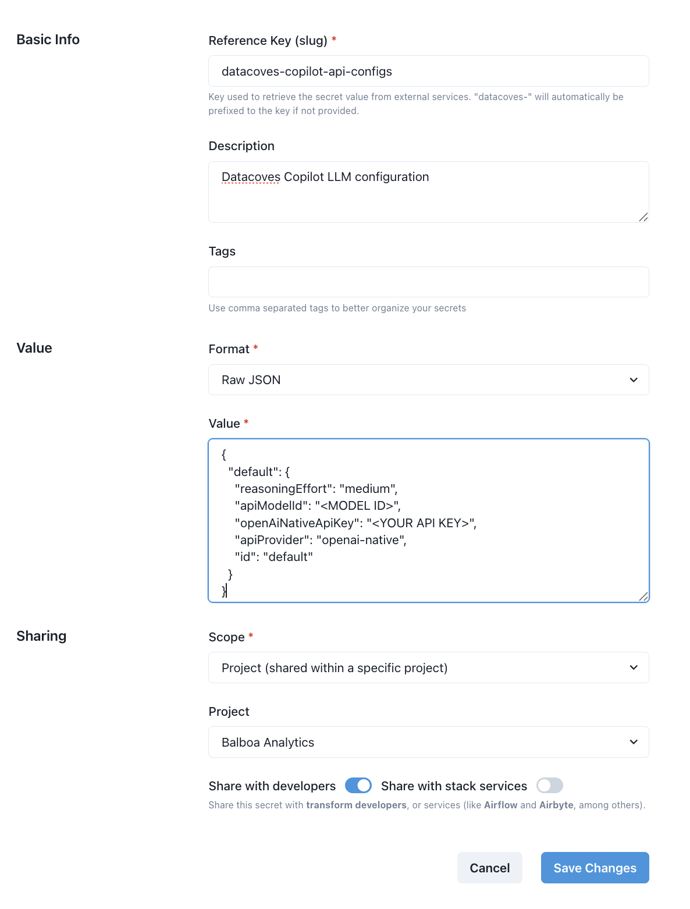

# Datacoves Copilot v2

This section describes how to configure and use Datacoves Copilot v2, which comes installed on Datacoves v4+, enhancing the experience and supporting the following LLM providers:

- Anthropic
- DeepSeek
- Google Gemini
- OpenAI
- Azure OpenAI
- OpenAI Compatible
- Open Router
- xAI (Grok)

## How Tos

import Tabs from '@theme/Tabs';
import TabItem from '@theme/TabItem';

<Tabs defaultValue="config" values={[
{label: 'Config', value: 'config'},
{label: 'Anthropic', value: 'anthropic'},
{label: 'OpenAI', value: 'openai'},
{label: 'Azure OpenAI', value: 'azure'},
{label: 'OpenAI Compatible', value: 'openaicompatible'},
{label: 'Google Gemini', value: 'gemini'},
{label: 'More Providers', value: 'additional'},
]}>

  <TabItem value="config">

## Configure your LLM in Datacoves Copilot v2

## Create a Datacoves Secret

Creating a [Datacoves Secret](/how-tos/datacoves/how_to_secrets.md) requires some key fields to be filled out:

- **Name:** The secret must be named `datacoves-copilot-api-configs`
- **Description:** Provide a simple description such as: `Datacoves Copilot config`
- **Format:** Select `Raw JSON`
- **Value**: The value will vary depending on the LLM you are utilizing, click on the corresponding tab or on `More Providers` to see more.
- **Scope:** Select the desired scope, either `Project` or `Environment`.
- **Project/Environment:** Select the `Project` or `Environment` that will access this LLM.

Lastly, be sure to toggle on the `Share with developers` option so that users with developer access will be able to use the LLM.


### Example Secret



### Learn more about Generative AI Use Cases with Datacoves Copilot

#### Expand SELECT \* into columns

<iframe
  width="800"
  height="500"
  src="https://www.youtube.com/embed/7TYHnlaH-T8"
  frameborder="0"
  allow="accelerometer; autoplay; clipboard-write; encrypted-media; gyroscope; picture-in-picture; fullscreen"
  allowfullscreen
></iframe>

#### Generate Airflow DAG to run DBT

<iframe
  width="800"
  height="500"
  src="https://www.youtube.com/embed/Q0QEzQkdFpg"
  frameborder="0"
  allow="accelerometer; autoplay; clipboard-write; encrypted-media; gyroscope; picture-in-picture; fullscreen"
  allowfullscreen
></iframe>

  </TabItem>

  <TabItem value="anthropic">

## Anthropic LLM Provider

Anthropic is an AI safety and research company that builds reliable, interpretable, and steerable AI systems. Their Claude models are known for their strong reasoning abilities, helpfulness, and honesty.

Website: https://www.anthropic.com/

### Secret value format

```json
{
  "default": {
    "todoListEnabled": true,
    "consecutiveMistakeLimit": 3,
    "apiKey": "<YOUR API KEY>",
    "apiModelId": "<MODEL ID>",
    "apiProvider": "anthropic",
    "id": "default"
  }
}
```

### Getting an API Key

1. Sign Up/Sign In: Go to the Anthropic Console. Create an account or sign in.
2. Navigate to API Keys: Go to the API keys section.
3. Create a Key: Click "Create Key". Give your key a descriptive name (e.g., "Datacoves").
4. Copy the Key: Important: Copy the API key immediately. You will not be able to see it again. Store it securely.

### Supported Models (`apiModelId`)

Datacoves Copilot supports the following Anthropic Claude models:

- claude-sonnet-4-5 (Recommended - default)
- claude-sonnet-4-20250514
- claude-opus-4-5-20251101
- claude-opus-4-1-20250805
- claude-opus-4-20250514
- claude-haiku-4-5-20251001
- claude-3-7-sonnet-20250219
- claude-3-7-sonnet-20250219:thinking (Extended Thinking variant)
- claude-3-5-sonnet-20241022
- claude-3-5-haiku-20241022
- claude-3-opus-20240229
- claude-3-haiku-20240307

See [Anthropic's Model Documentation](https://docs.claude.com/en/docs/about-claude/models/overview) for more details on each model's capabilities.

</TabItem>
<TabItem value="openai">

## OpenAI LLM Provider

Datacoves Copilot supports accessing models directly through the official OpenAI API, including the latest GPT-5 family with advanced features like reasoning effort control and verbosity settings.

Website: https://openai.com/

### Secret value format

```json
{
  "default": {
    "reasoningEffort": "medium",
    "apiModelId": "<MODEL ID>",
    "openAiNativeApiKey": "<YOUR API KEY>",
    "apiProvider": "openai-native",
    "id": "default"
  }
}
```

### Getting an API Key

1. Sign Up/Sign In: Go to the OpenAI Platform. Create an account or sign in.
2. Navigate to API Keys: Go to the API keys page.
3. Create a Key: Click "Create new secret key". Give your key a descriptive name (e.g., "Datacoves").
4. Copy the Key: Important: Copy the API key immediately. You will not be able to see it again. Store it securely.

### Supported Models (`apiModelId`)

#### GPT-5.x Family (Latest)

The GPT-5.x models are OpenAI's most advanced, offering superior coding capabilities and agentic task performance:

- gpt-5.1-codex-max (default) - Most intelligent coding model optimized for long-horizon, agentic coding tasks (400K context)
- gpt-5.2 - Flagship model for coding and agentic tasks across industries (400K context)
- gpt-5.2-chat-latest - Optimized for conversational AI and chat use cases
- gpt-5.1 - Best model for coding and agentic tasks across domains (400K context)
- gpt-5.1-codex - Optimized for agentic coding in Codex (400K context)
- gpt-5.1-codex-mini - Cost-efficient version optimized for agentic coding (400K context)

#### GPT-5 Family

- gpt-5 - Best model for coding and agentic tasks across domains (400K context)
- gpt-5-mini - Faster, cost-efficient for well-defined tasks
- gpt-5-nano - Fastest, most cost-efficient option
- gpt-5-codex - Specialized coding model

#### GPT-4.1 Family

Advanced multimodal models with balanced capabilities:

- gpt-4.1 - Advanced multimodal model
- gpt-4.1-mini - Balanced performance
- gpt-4.1-nano - Lightweight option

#### o3 Reasoning Models

Models with configurable reasoning effort for complex problem-solving:

- o3, o3-high, o3-low - Different reasoning effort presets
- o3-mini (medium reasoning effort)
- o3-mini-high (high reasoning effort)
- o3-mini-low (low reasoning effort)

#### o4 Models

Latest mini reasoning models:

- o4-mini
- o4-mini-high
- o4-mini-low

#### o1 Family

Original reasoning models:

- o1 - Original reasoning model
- o1-preview - Preview version
- o1-mini - Smaller variant

#### GPT-4o Family

Optimized GPT-4 models:

- gpt-4.5-preview
- gpt-4o - Optimized GPT-4
- gpt-4o-mini - Smaller optimized variant

Refer to the [OpenAI Models documentation](https://platform.openai.com/docs/models) for the most up-to-date list of models and capabilities.

</TabItem>
<TabItem value="azure">

## Azure OpenAI LLM Provider

Datacoves Copilot supports Azure OpenAI models through the OpenAI API compatible interface.

Website: https://azure.microsoft.com/en-us/products/ai-services/openai-service

### Secret value format

```json
{
  "default": {
    "apiProvider": "openai",
    "openAiApiKey": "<YOUR AZURE API KEY>",
    "openAiBaseUrl": "https://<your-resource>.cognitiveservices.azure.com/openai/deployments/<deployment-name>/chat/completions?api-version=<API VERSION>",
    "openAiModelId": "<deployment-name>",
    "openAiUseAzure": true,
    "id": "default"
  }
}
```

### Getting Azure OpenAI Credentials

1. **Create Azure OpenAI Resource**: Go to Azure Portal and create an Azure OpenAI service resource
2. **Deploy a Model**: In Azure AI Foundry, deploy a model (e.g., gpt-4o, gpt-4.1, gpt-5)
3. **Get Endpoint**: Copy your endpoint URL from the resource overview
4. **Get API Key**: Navigate to "Keys and Endpoint" section and copy one of the API keys
5. **Get Deployment Name**: Use the deployment name you created (not the model name)

### Endpoint URL Format

Datacoves Copilot uses the **Chat Completions API**, so your `openAiBaseUrl` must use the chat completions path, including the deployment name and `api-version` parameter:

```
https://<your-resource>.cognitiveservices.azure.com/openai/deployments/<deployment-name>/chat/completions?api-version=<API VERSION>
```

For models that support **both** the Responses API and the Chat Completions API (for example GPT-4.1, GPT-5.x, o3, o4-mini), **always** use the Chat Completions URL above in Datacoves Copilot and **do not** use the default `/openai/v1/responses` URL shown in some Azure examples.

### Supported Azure OpenAI Models (`openAiModelId`)

Use your **deployment name** from Azure AI Foundry as the `openAiModelId`. This must match the deployment name exactly (for example `gpt-5.1` if your deployment is named `gpt-5.1`), not just the base model family name.

#### GPT-5 Series (Latest)

**Models with Chat Completions API support:**
- gpt-5.2 (2025-12-11) - Flagship model, 400K context
- gpt-5.2-chat (2025-12-11) - Chat optimized
- gpt-5.1 (2025-11-13) - Advanced reasoning, 400K context
- gpt-5.1-chat (2025-11-13) - Chat optimized reasoning
- gpt-5 (2025-08-07) - Advanced reasoning, 400K context
- gpt-5-mini (2025-08-07) - Cost-efficient, 400K context
- gpt-5-nano (2025-08-07) - Fast, cost-efficient, 400K context
- gpt-5-chat (2025-08-07, 2025-10-03) - Conversational, 128K context
- gpt-oss-120b - Open-weight reasoning model
- gpt-oss-20b - Open-weight reasoning model

**Note:** The following GPT-5 models use Responses API only and are **not supported** by Datacoves Copilot:
- gpt-5-codex, gpt-5-pro, gpt-5.1-codex, gpt-5.1-codex-mini, gpt-5.1-codex-max

#### GPT-4.1 Series

- gpt-4.1 (2025-04-14) - Advanced multimodal, 1M context
- gpt-4.1-mini (2025-04-14) - Balanced performance, 1M context
- gpt-4.1-nano (2025-04-14) - Lightweight, 1M context

#### GPT-4o Series

- gpt-4o (2024-11-20) - Optimized GPT-4, 128K context
- gpt-4o (2024-08-06) - Optimized GPT-4, 128K context
- gpt-4o (2024-05-13) - Original GPT-4o, 128K context
- gpt-4o-mini (2024-07-18) - Fast, cost-efficient, 128K context

#### GPT-4 Series

- gpt-4 (turbo-2024-04-09) - GPT-4 Turbo with Vision, 128K context

#### o-Series Reasoning Models

- o3 (2025-04-16) - Reasoning model, 200K context
- o4-mini (2025-04-16) - Mini reasoning, 200K context
- o3-mini (2025-01-31) - Compact reasoning, 200K context
- o1 (2024-12-17) - Reasoning model, 200K context
- o1-mini (2024-09-12) - Smaller reasoning, 128K context
- codex-mini (2025-05-16) - Coding specialized, 200K context

#### GPT-3.5 Series

- gpt-35-turbo (0125) - Chat optimized, 16K context
- gpt-35-turbo (1106) - Chat optimized, 16K context
- gpt-35-turbo-instruct (0914) - Completions API only

**Important Notes:**
- Datacoves Copilot uses the Chat Completions API endpoint
- Responses API is not currently supported for Azure OpenAI
- Use your **deployment name** in Azure as both the URL path segment and `openAiModelId`
- The `api-version` parameter is required in the endpoint URL

Refer to [Azure OpenAI documentation](https://learn.microsoft.com/en-us/azure/ai-foundry/openai/concepts/models) for the most current model availability and regional deployment options.

</TabItem>
<TabItem value="openaicompatible">

#### OpenAI Compatible

## OpenAI Compatible LLM Providers

Datacoves Copilot supports a wide range of AI model providers that offer APIs compatible with the OpenAI API standard. This means you can use models from providers other than OpenAI, while still using a familiar API interface. This includes providers like:

- Local models running through tools like Ollama and LM Studio (covered in separate sections).
- Cloud providers like Perplexity, Together AI, Anyscale, and others.
- Any other provider offering an OpenAI-compatible API endpoint.

**Note:** For Azure OpenAI, see the dedicated [Azure OpenAI tab](#azure-openai) for specific setup instructions.

### Secret value format

```json
{
  "default": {
    "reasoningEffort": "medium",
    "openAiBaseUrl": "<BASE URL>",
    "openAiApiKey": "<YOUR API KEY>",
    "openAiModelId": "<MODEL ID>",
    "openAiUseAzure": false,
    "azureApiVersion": "",
    "openAiHeaders": {},
    "apiProvider": "openai",
    "id": "default"
  }
}
```

Where:

1. `openAiBaseUrl`: This is the API endpoint for the provider. It will not be https://api.openai.com/v1 (that's for the official OpenAI API).
2. `openAiApiKey`: This is the secret key you obtain from the provider.
3. `openAiModelId`: This is the model name of the specific model, each provider will expose a different set of models, please check provider's documentation.


#### Fine tune model usage

Fine tune model usage using this additional configuration under the `openAiCustomModelInfo` key.

```json
"openAiCustomModelInfo": {
    "maxTokens": -1,
    "contextWindow": 128000,
    "supportsImages": true,
    "supportsPromptCache": false,
    "inputPrice": 0,
    "outputPrice": 0,
    "reasoningEffort": "medium"
}
```

</TabItem>
<TabItem value="gemini">

## Google Gemini LLM Provider

Datacoves Copilot supports Google's Gemini family of models through the Google AI Gemini API.

Website: https://ai.google.dev/

### Secret value format

```json
{
  "default": {
    "apiModelId": "<MODEL ID>",
    "geminiApiKey": "<YOUR API KEY>",
    "apiProvider": "gemini",
    "id": "default"
  }
}
```

### Getting an API Key

1. Go to Google AI Studio: Navigate to https://ai.google.dev/.
2. Sign In: Sign in with your Google account.
3. Create API Key: Click on "Create API key" in the left-hand menu.
4. Copy API Key: Copy the generated API key.

### Supported Models (`apiModelId`)

Datacoves Copilot supports the following Gemini models:

#### Gemini 3 (Latest)

- gemini-3-pro-preview (Recommended - default) - 1M token context window with reasoning support
- gemini-3-flash-preview - Fast, cost-efficient with 1M token context window

#### Gemini 2.5 Pro Models

- gemini-2.5-pro - 1M token context with thinking support
- gemini-2.5-pro-preview-06-05
- gemini-2.5-pro-preview-05-06
- gemini-2.5-pro-preview-03-25

#### Gemini 2.5 Flash Models

- gemini-flash-latest - Always uses the newest stable Flash model
- gemini-2.5-flash - 1M token context with thinking support
- gemini-2.5-flash-preview-09-2025
- gemini-flash-lite-latest - Lightweight option
- gemini-2.5-flash-lite-preview-09-2025

Refer to the [Gemini documentation](https://ai.google.dev/gemini-api/docs/models) for more details on each model.

</TabItem>
<TabItem value="additional">

## Additional LLM Providers

Datacoves Copilot supports additional LLM providers, you can find the secret value format for each one of them and additional documentation.

### DeepSeek

Datacoves Copilot supports accessing models through the DeepSeek API, including deepseek-chat and deepseek-reasoner.

Website: https://platform.deepseek.com/

#### Secret value format

```json
{
  "default": {
    "apiModelId": "<MODEL ID>",
    "deepSeekApiKey": "<YOUR API KEY>",
    "apiProvider": "deepseek",
    "id": "default"
  }
}
```

#### Getting an API Key

1. Sign Up/Sign In: Go to the DeepSeek Platform. Create an account or sign in.
2. Navigate to API Keys: Find your API keys in the API keys section of the platform.
3. Create a Key: Click "Create new API key". Give your key a descriptive name (e.g., "Datacoves").
4. Copy the Key: Important: Copy the API key immediately. You will not be able to see it again. Store it securely.

#### Supported Models (`apiModelId`)

- deepseek-chat (Recommended for coding tasks)
- deepseek-reasoner (Recommended for reasoning tasks)
- deepseek-r1

### Open Router

OpenRouter is an AI platform that provides access to a wide variety of language models from different providers, all through a single API. This can simplify setup and allow you to easily experiment with different models.

Website: https://openrouter.ai/

#### Secret value format

```json
{
  "default": {
    "reasoningEffort": "medium",
    "openRouterApiKey": "<YOUR API KEY>",
    "openRouterModelId": "<MODEL ID>",
    "apiProvider": "openrouter",
    "id": "default"
  }
}
```

#### Getting an API Key

1. Sign Up/Sign In: Go to the OpenRouter website. Sign in with your Google or GitHub account.
2. Get an API Key: Go to the keys page. You should see an API key listed. If not, create a new key.
3. Copy the Key: Copy the API key.

#### Supported Models (`openRouterModelId`)

OpenRouter supports a large and growing number of models.
Refer to the [OpenRouter Models page](https://openrouter.ai/models) for the complete and up-to-date list.

### xAI Grok

xAI is the company behind Grok, a large language model known for its conversational abilities and large context window.
Grok models are designed to provide helpful, informative, and contextually relevant responses.

Website: https://x.ai/

#### Secret value format

```json
{
  "default": {
    "reasoningEffort": "medium",
    "apiModelId": "<MODEL ID>",
    "xaiApiKey": "<YOUR API KEY>",
    "apiProvider": "xai",
    "id": "default"
  }
}
```

#### Getting an API Key

1. Sign Up/Sign In: Go to the xAI Console. Create an account or sign in.
2. Navigate to API Keys: Go to the API keys section in your dashboard.
3. Create a Key: Click to create a new API key. Give your key a descriptive name (e.g., "Datacoves").
4. Copy the Key: Important: Copy the API key immediately. You will not be able to see it again. Store it securely.

#### Supported Models (`apiModelId`)

- grok-code-fast-1 (Default) - xAI's Grok Code Fast model with 262K context window and prompt caching, optimized for reasoning and coding tasks
- grok-4 - xAI's Grok-4 model with 262K context window, image support, and prompt caching
- grok-3 - xAI's Grok-3 model with 128K context window and prompt caching
- grok-3-fast - xAI's Grok-3 fast model with 128K context window and prompt caching
- grok-3-mini - xAI's Grok-3 mini model with 128K context window, reasoning support, and prompt caching
- grok-3-mini-fast - xAI's Grok-3 mini fast model with 128K context window, reasoning support, and prompt caching
- grok-2-1212 - xAI's Grok-2 model (version 1212) with 128K context window
- grok-2-vision-1212 - xAI's Grok-2 Vision model (version 1212) with image support and 32K context window

Learn more about available models at [xAI Docs](https://docs.x.ai/docs/models).

  </TabItem>

</Tabs>
