# How to Configure your VS Code in the Datacoves Transform tab


When you first log into Datacoves, you will see that VS Code is disabled.


We need to connect to your git repository and to your data warehouse and configure your dbt profiles.yml. To do this, you need to update your user settings.


## Open Your User Settings


At the top right corner of the page, click the User icon and select _Settings_


<div style={{ maxWidth: "700px", margin: "0 auto" }}>

</div>


## Setup git connection credentials


On the settings page scroll down to the Git SSH keys section.


<div style={{ maxWidth: "700px", margin: "0 auto" }}>
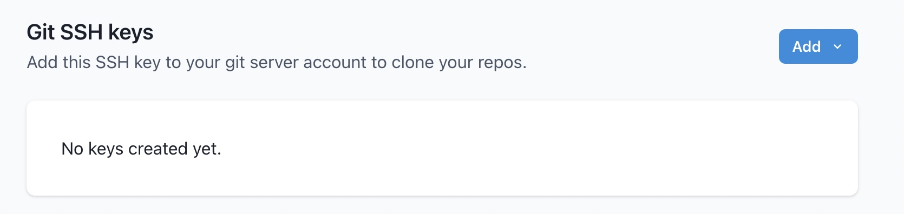
</div>


Click the Add drop down and select whether you want to provide an existing private key or have Datacoves auto generate one for you.


<div style={{ maxWidth: "300px", margin: "0 auto" }}>
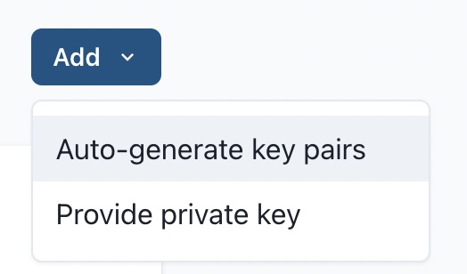
</div>


Datacoves will generate and display the corresponding public key, you will need to configure the public key for your git provider.


<div style={{ maxWidth: "700px", margin: "0 auto" }}>
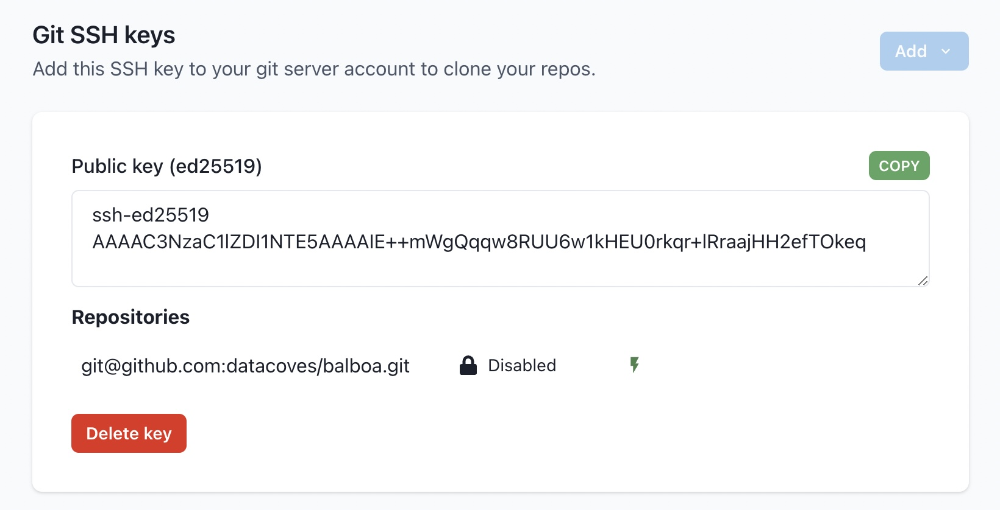
</div>


Click the _Copy_ button and follow the instructions to configure the public key for your git server.


[Github SSH Key Configuration Instructions](https://docs.github.com/en/authentication/connecting-to-github-with-ssh/adding-a-new-ssh-key-to-your-github-account)


[Gitlab SSH Key Configuration Instructions](https://www.theserverside.com/blog/Coffee-Talk-Java-News-Stories-and-Opinions/How-to-configure-GitLab-SSH-keys-for-secure-Git-connections#:~:text=Configure%20GitLab%20SSH%20keys,-Log%20into%20GitLab%20and%20click)


[Bitbucket SSH Key Configuration Instructions](https://dev.to/jorge_rockr/configuring-ssh-key-for-bitbucket-repositories-2925)


Once your public SSH key has been added to your git server, test your connection.


<div style={{ maxWidth: "700px", margin: "0 auto" }}>
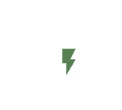
</div>


If Datacoves is able to connect to your Git repository, you will see _Tested_ next to the repository url.


<div style={{ maxWidth: "700px", margin: "0 auto" }}>

</div>

# Set up Database Connection 

:::note
Below you will see a reference chart with the information you will need based on your data warehouse provider. **Select your data warehouse provider from the table below to see the how to guide.**
:::

<details>
  <summary><strong>BigQuery Setup Instructions</strong></summary>

# BigQuery Setup

In the Database Connection Section, click `Add`

<div style={{ maxWidth: "700px", margin: "0 auto" }}>
  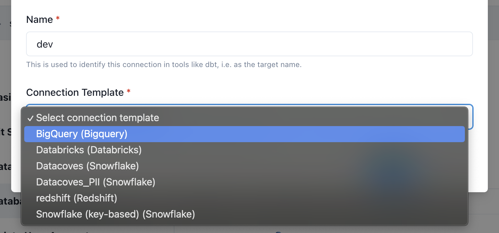
</div>

Give the connection a name.

:::tip
This will be used as your dbt target name and is typically `dev`.
:::

Next select a connection template. A connection template will have defaults pre-configured by your administrator.

## Fill in connection details

Datacoves will test the connection and display `Tested` next to the connection if successful.

<div style={{ maxWidth: "700px", margin: "0 auto" }}>
  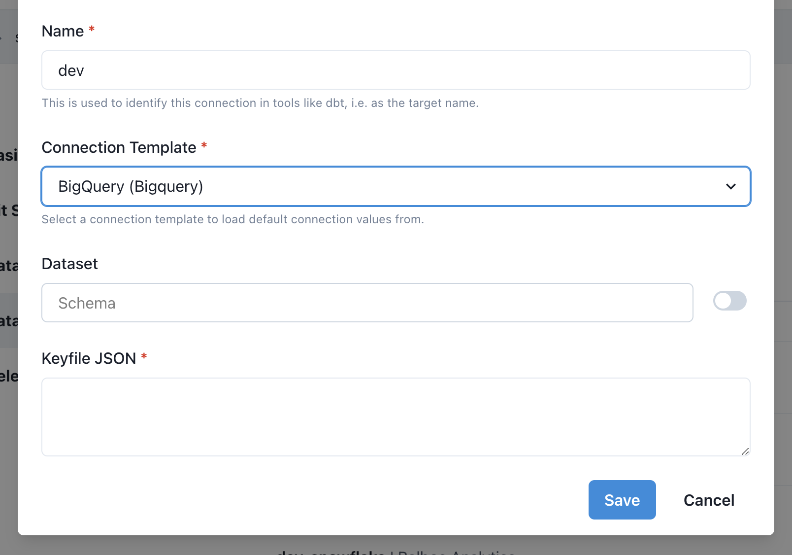
</div>

Click `Save`

</details>

<details>
  <summary><strong>Databricks Setup Instructions</strong></summary>

# Databricks Setup

In the Database Connection Section, click `Add`

<div style={{ maxWidth: "700px", margin: "0 auto" }}>
  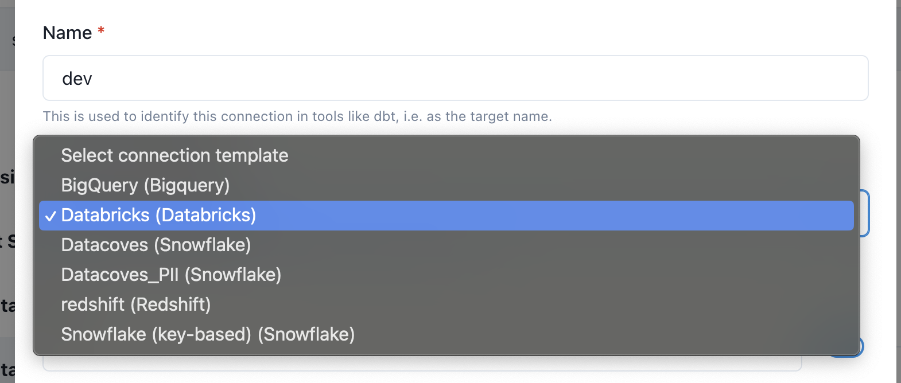
</div>

Give the connection a name.

:::tip
This will be used as your dbt target name and is typically `dev`.
:::

Next select a connection template. A connection template will have defaults pre-configured by your administrator.

## Fill in connection details

Datacoves will test the connection and display `Tested` next to the connection if successful.

<div style={{ maxWidth: "700px", margin: "0 auto" }}>
  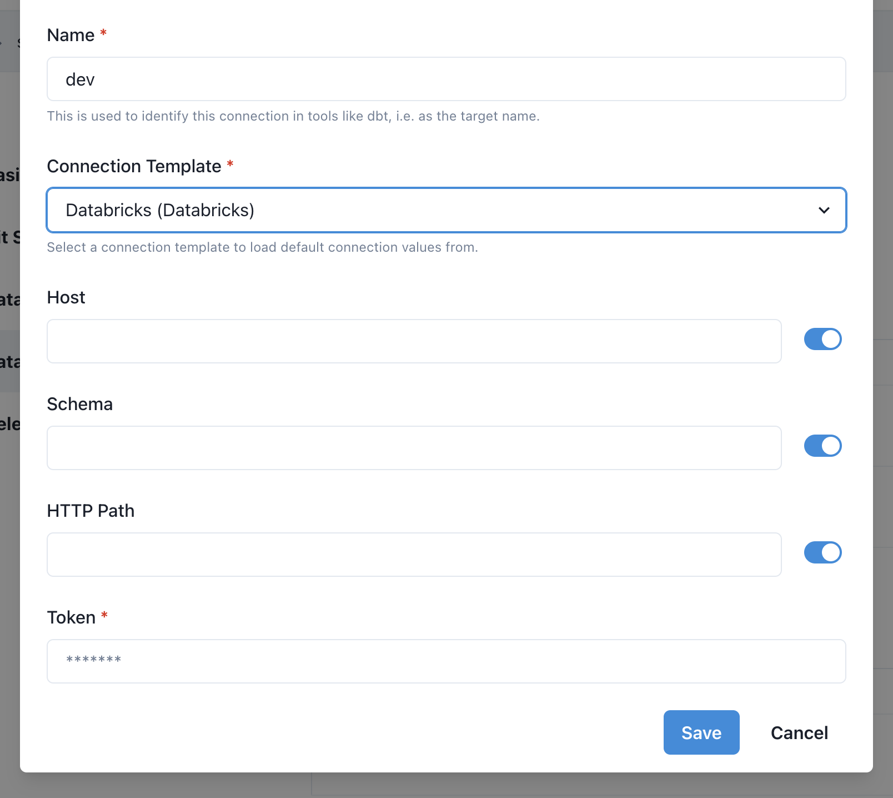
</div>

Click `Save`

</details>

<details>
  <summary><strong>Redshift Setup Instructions</strong></summary>

# Redshift Setup

In the Database Connection Section, click `Add`

<div style={{ maxWidth: "700px", margin: "0 auto" }}>
  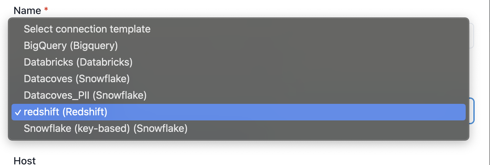
</div>

Give the connection a name.

:::tip
This will be used as your dbt target name and is typically `dev`.
:::

Next select a connection template. A connection template will have defaults pre-configured by your administrator.

## Fill in connection details

Datacoves will test the connection and display `Tested` next to the connection if successful.

<div style={{ maxWidth: "700px", margin: "0 auto" }}>
  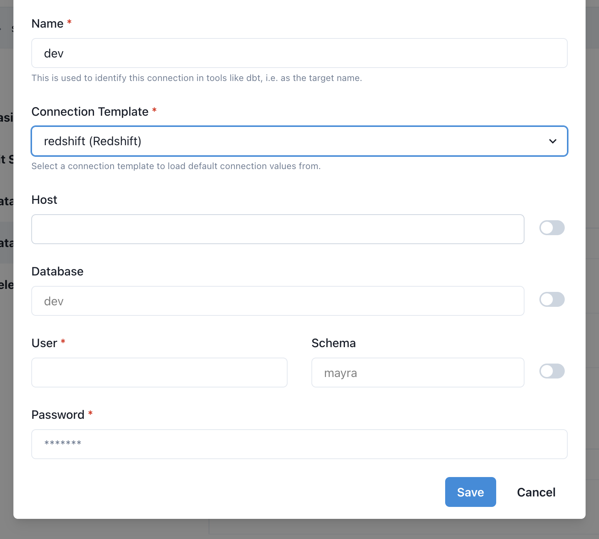
</div>

Click `Save`

</details>

<details>
  <summary><strong>Snowflake Setup Instructions</strong></summary>

# Snowflake Setup

## Setup Snowflake with Key Pair

When connecting to Snowflake, you can use either key based authentication or username/password authentication.

:::note
To enable key-pair authentication, your admin must select `Inferred from user info using a custom template` when setting up the [Connection Template](/how-tos/datacoves/how_to_connection_template.md). The Snowflake username must match the username associated with the email used to authenticate with Datacoves, e.g., `some_user` would be the Snowflake username for `some_user@example.com`.
:::

If using key based authentication, you will need to provide or generate a key which will need to be added to Snowflake manually or contact us for information on how to automate this integration with Snowflake.

Provide or automatically generate your keys. Then add the public key to Snowflake.

<div style={{ maxWidth: "700px", margin: "0 auto" }}>
  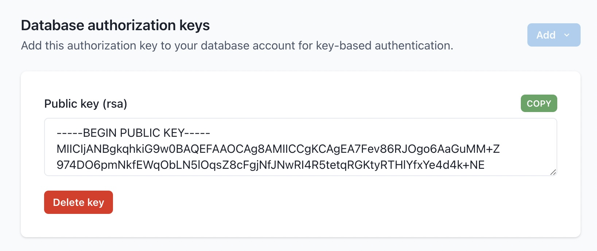
</div>

## Assign the public key to the Snowflake User

```
alter user <username> set rsa_public_key='<public key>';
```

More information can be found in the [Snowflake Documentation](https://docs.snowflake.com/en/user-guide/key-pair-auth.html#step-4-assign-the-public-key-to-a-snowflake-user)

## Complete the connection

In the Database Connection Section, click `Add`

<div style={{ maxWidth: "200px", margin: "0 auto" }}>
  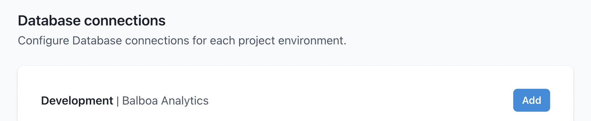
</div>

Give the connection a name.

:::tip
This will be used as your dbt target name and is typically `dev`.
:::

Next select a connection template. A connection template will have defaults pre-configured by your administrator.

<div style={{ maxWidth: "700px", margin: "0 auto" }}>
  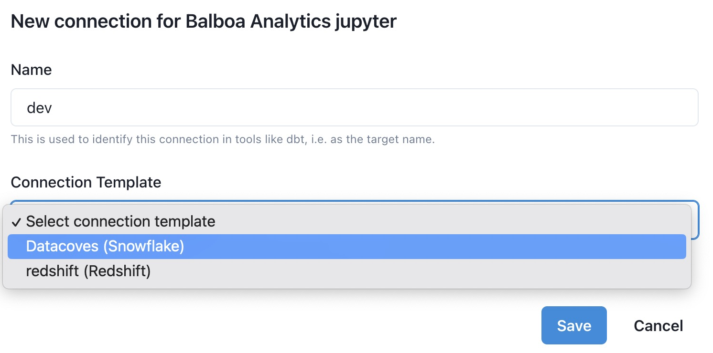
</div>

## Fill in connection details

Datacoves will test the connection and display `Tested` next to the connection if successful.

:::note
You can create additional dbt targets as shown below. This will allow you to execute dbt commands passing a specific target such as `dbt run my_model -t prd`
:::

<div style={{ maxWidth: "700px", margin: "0 auto" }}>
  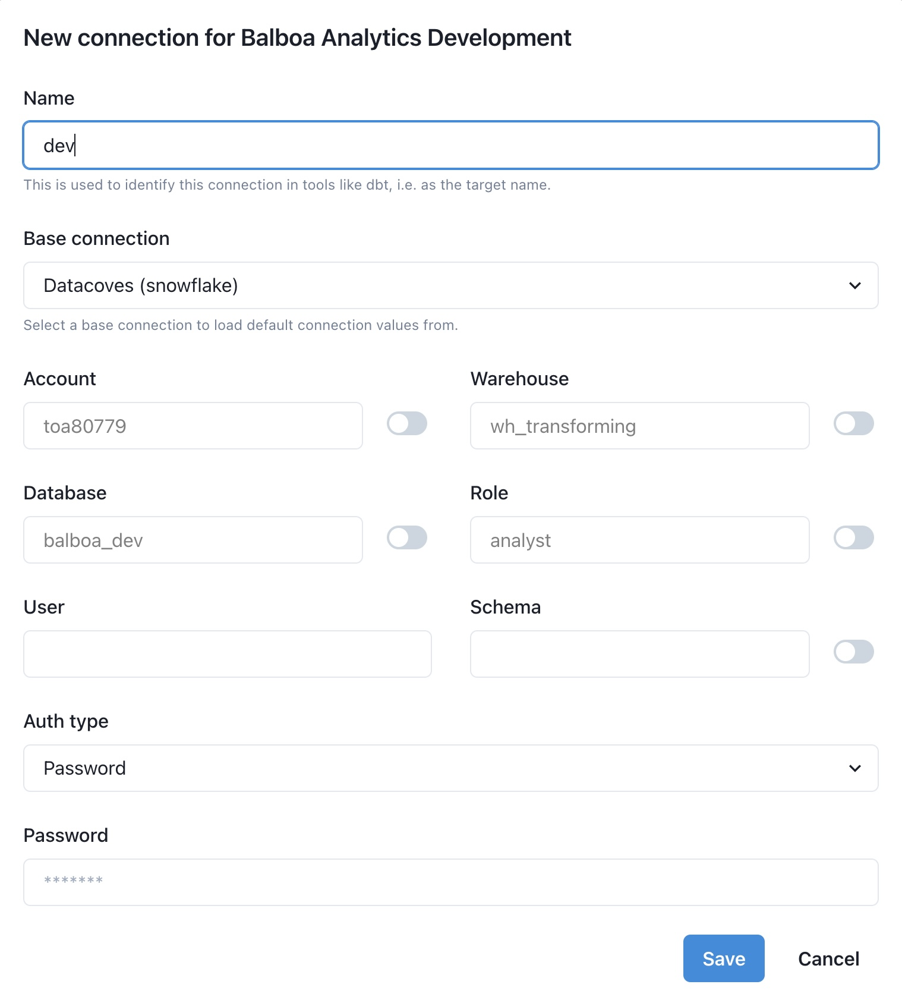
</div>

### Key Pair

If using key pair, you will need to change the auth method to key-pair.

<div style={{ maxWidth: "700px", margin: "0 auto" }}>
  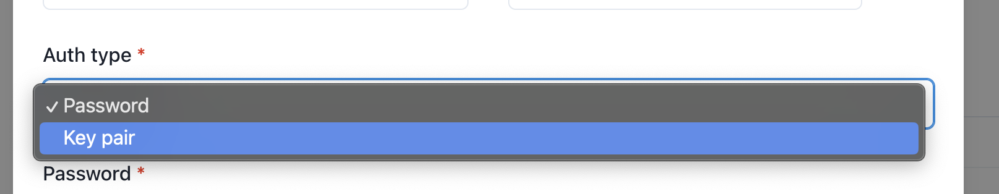
</div>

Select the drop down and your key you configured earlier should populate.

<div style={{ maxWidth: "700px", margin: "0 auto" }}>
  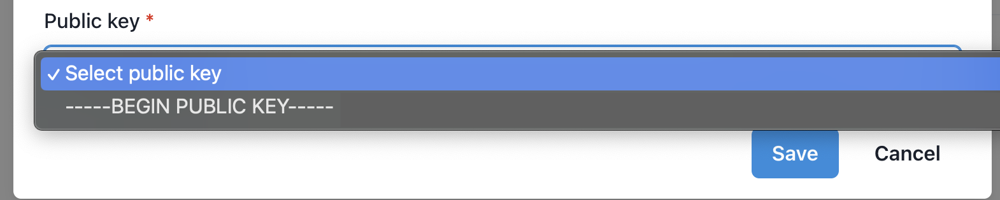
</div>

Click `Save`

</details>

## Once your data warehouse is configured you are now ready to transform your data with dbt

- Scroll to the top of the screen, click `Launchpad` or the Datacoves logo.
- Click `Open` to go into your development environment.

:::note
Datacoves will take a couple of minutes to apply the new settings, clone your repo, and finish setting up your environment for the first time.
:::

<div style={{ maxWidth: "700px", margin: "0 auto" }}>
  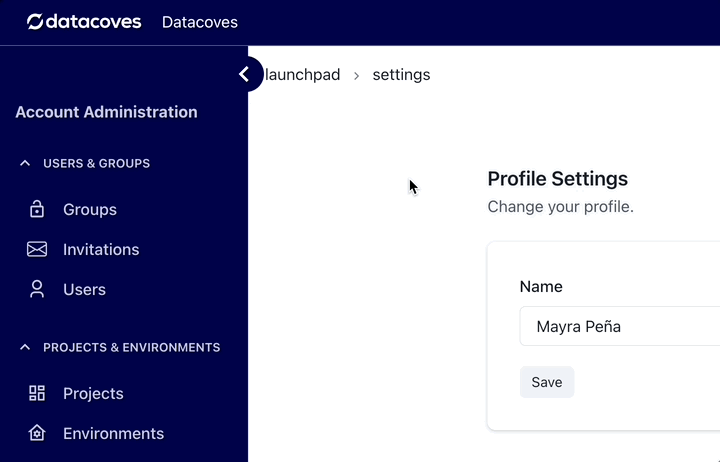
</div>
