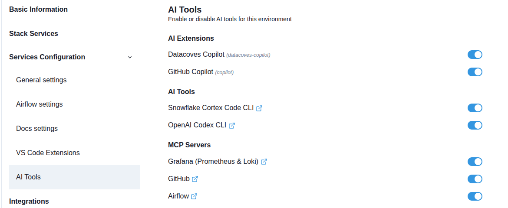

# MCP Servers

Datacoves can connect your AI coding assistants to live data systems through
[MCP (Model Context Protocol)](https://modelcontextprotocol.io/) servers. An MCP server gives an
AI tool structured, read access to an external system so it can answer questions grounded in your
real data instead of guessing.

Datacoves ships three MCP servers:

| Server | What it exposes | User setup |
|--------|-----------------|------------|
| [GitHub](/docs/how-tos/vs-code/mcp/github) | Your repositories, pull requests, issues, and CI checks | A GitHub personal access token |
| [Airflow](/docs/how-tos/vs-code/mcp/airflow) | Your DAGs, runs, and task logs (read-only) | None |
| [Grafana (Prometheus & Loki)](/docs/how-tos/vs-code/mcp/grafana) | Metrics and logs from your environment | None |

Once enabled, these servers are available to every AI tool in your workspace:

- Datacoves Copilot
- GitHub Copilot
- [OpenAI Codex](/docs/how-tos/vs-code/external-ai-tools/openai-codex)
- [Snowflake Cortex](/docs/how-tos/vs-code/external-ai-tools/snowflake-cortex)

## Enabling MCP servers

MCP servers are toggled per environment by an administrator.

:::note
You need admin access to enable MCP servers. Go to **Admin > Environments**, edit the
environment, open the **AI Tools** tab, and turn on the servers you want under **MCP Servers**.
:::

After a server is enabled, it appears automatically in each AI tool the next time the workspace
starts. No further configuration is needed in the tools themselves.

:::tip
The **Grafana (Prometheus & Loki)** toggle only appears when the **observability stack** is
enabled for your cluster. Contact [Datacoves support](mailto:support@datacoves.com) if you do not
see it.
:::

## What you can ask

Each server page includes example prompts. A few to get started:

- **GitHub:** "Check my last pull request and explain why the CI check failed."
- **Airflow:** "Check the log of the task that failed in my last DAG run and recommend a fix."
- **Grafana:** "Query the metrics and logs for my environment and summarize recent failures."
