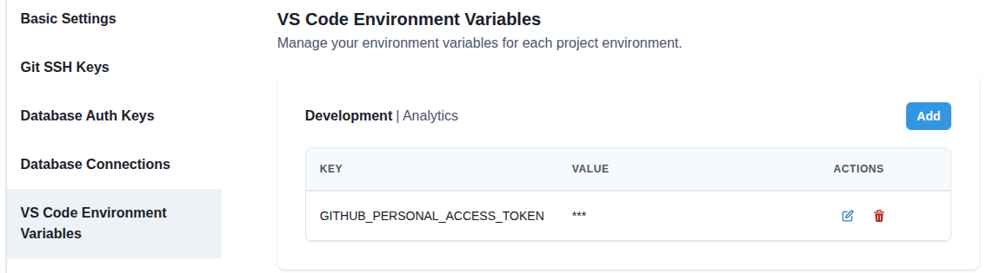

# GitHub MCP Server

The GitHub MCP server lets your AI tools read your GitHub repositories, pull requests, issues, and
CI checks, so you can ask questions like why a check failed and get an answer based on the real
pull request.

It is backed by [GitHub's official MCP server](https://github.com/github/github-mcp-server).

## Prerequisites

- The **GitHub** MCP server enabled for your environment (see [Enabling](#enabling)).
- A GitHub [personal access token](https://github.com/settings/tokens) with access to the
  repositories you want the AI to read.

## Provide your GitHub token

The GitHub MCP server acts as **you**, using your own personal access token. You provide it as a
VS Code environment variable, so it is never shared with other users.

### Step 1: Create a personal access token

In GitHub, create a [personal access token](https://github.com/settings/tokens) (classic or
fine-grained) with at least `repo` scope. Copy the token, you will not be able to see it again.

### Step 2: Add it as an environment variable

Add the token as a [user-level VS Code environment variable](/docs/how-tos/vs-code/environment-variables)
named:

```
GITHUB_PERSONAL_ACCESS_TOKEN
```



:::tip
The value is automatically masked in the UI because the variable name contains `token`.
:::

## Enabling

:::note
An administrator enables the server in **Admin > Environments > _your environment_ > AI Tools >
MCP Servers** by turning on **GitHub**.
:::

## Use it

Start (or restart) your workspace so the AI tools pick up the server, then ask, for example:

> Check my last pull request, figure out why the CI check failed, and recommend a fix.

> List my open pull requests in this repository.

## Learn more

- [GitHub MCP server](https://github.com/github/github-mcp-server)
- [Managing personal access tokens](https://docs.github.com/en/authentication/keeping-your-account-and-data-secure/managing-your-personal-access-tokens)
