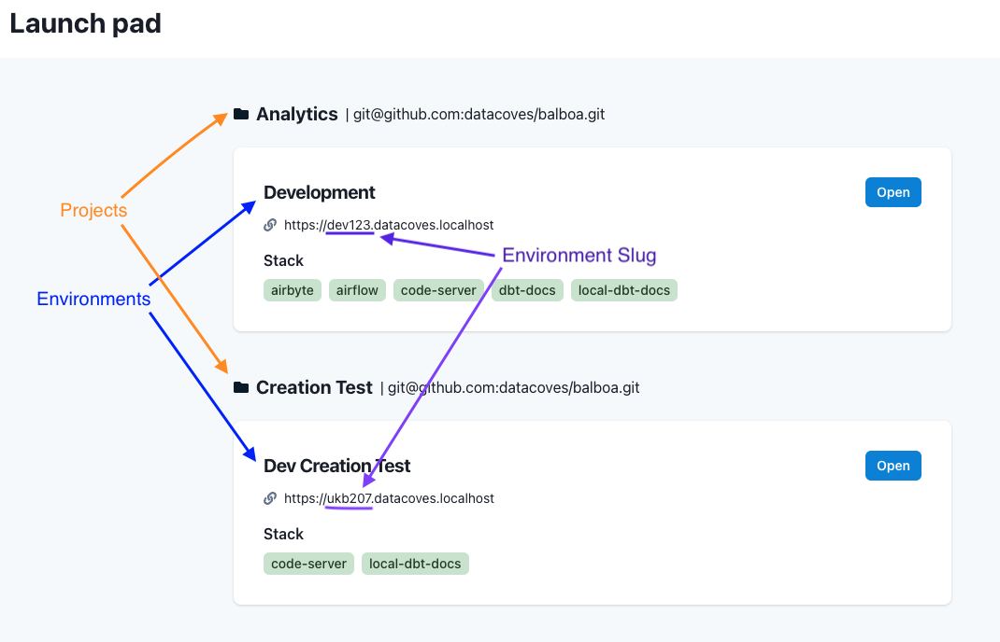
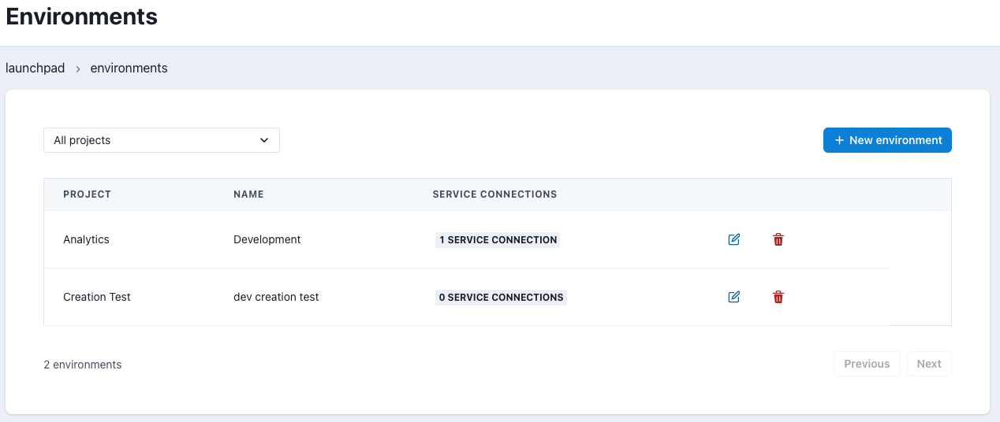

# Environments Admin

## Overview

An Environment in Datacoves defines a data stack and associated settings for a given project. These data stacks are isolated from each other and can be created for long term or temporary use to perform some tests such as to try out a new version of dbt with your project.

These environments are displayed on the launchpad to users that have the proper permission for the given environment.

:::tip
See our How To - [Environments](/docs/how-tos/datacoves/how_to_environments)
:::

## Environment Listing

On the Environments landing page you can see a list of environments associated with each of your Datacoves projects.

For each environment we can see the associated project, the name of the environment to be displayed on the landing page, and the number of associated service connections.

Each row contains 2 action buttons, Edit and Delete.

## AI Tools

When editing an environment that has VS Code enabled, the **AI Tools** tab controls the AI
assistants and the data systems they can reach. It has three sections:

- **AI Extensions** - enable or disable the built-in AI extensions, such as Datacoves Copilot and
  GitHub Copilot.
- **AI Tools** - enable or disable the AI CLI tools, such as OpenAI Codex and Snowflake Cortex
  (Cortex is only shown on Snowflake environments).
- **MCP Servers** - enable or disable the [MCP servers](/docs/how-tos/vs-code/mcp) (GitHub,
  Airflow, and Grafana) that give the AI tools read access to your repositories, DAGs, and
  metrics and logs.

:::note
The **Grafana (Prometheus & Loki)** MCP server only appears when the observability stack is
enabled for the cluster.
:::
