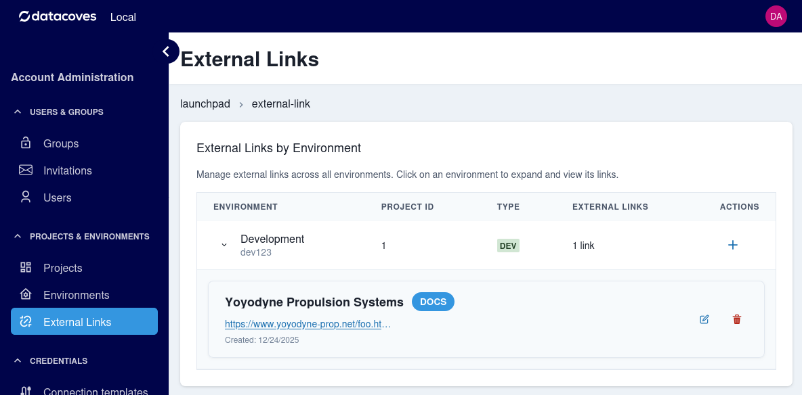

# External Links

## Overview

External links are a kind of bookmark which can be added by an administrator to the standard tabs atop a Datacoves screen: Docs, Load, Transform, Observe, Orchestrate, and Analyze.  They are useful for ensuring all users of a given environment have access to commonly used websites.

## Managing links

From the Launchpad sidebar, choose `External Links`:

You may choose an environment and look at the links already made.

- Edit and delete options are next to each link
- To add a link, click `+` next to the environment you wish to add a link to

When editing or adding a link, a small dialog will appear.  You can then add the title as you wish it to appear in the menu, a URL, and the tab it should appear under:

When finished, click Save.
