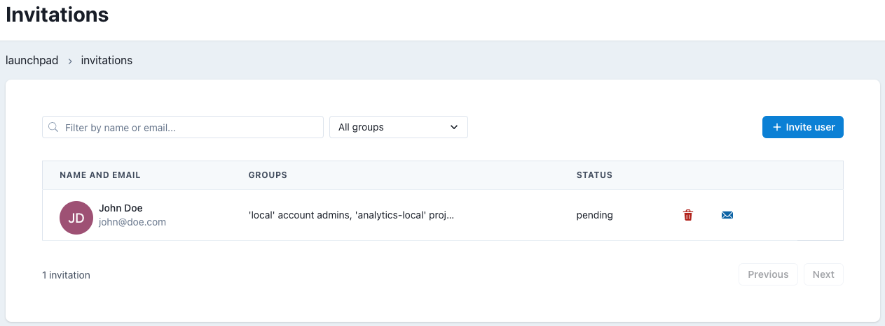

# Invitations Admin

## Overview

This page is used to invite users into your account.

:::tip
See our How To - [Invitations](/docs/how-tos/datacoves/how_to_invitations)
:::

## Invitation Listing

This grid shows all pending invitations for your account. Each row also has two action buttons `delete` which cancels an invitation and `resend` to resend an invitation link.

