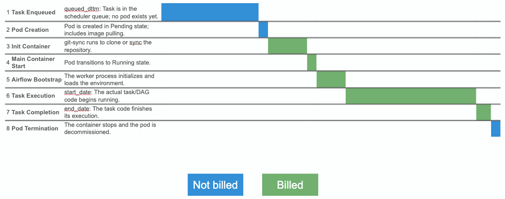

# How Datacoves Billing Works

This page explains how Datacoves measures and bills Airflow worker usage, what is and isn't included in billed minutes, and how billed usage relates to Airflow's own metadata.

## Overview

Datacoves bills Airflow usage based on **worker pod running time**. Each Airflow task runs inside a dedicated Kubernetes pod, and billing is based on how long that pod is alive in the cluster. This is different from the task durations shown in the Airflow UI, which only reflects when task code itself was running.

Billing is derived from the Prometheus metric:

```
kube_pod_container_status_running
```

This metric captures the time each worker pod container spends in the `Running` state. The total is summed across all pods in your environment to produce your monthly billed minutes.

## Task execution timeline

A typical task goes through eight stages from the moment it is enqueued to the moment its pod is decommissioned. Only some of these stages are billed.

| # | Stage | Description | Billed |
|---|---|---|---|
| 1 | Task Enqueued | `queued_dttm`: task is in the scheduler queue; no pod exists yet. | No |
| 2 | Pod Creation | Pod is created in `Pending` state; includes image pulling. | No |
| 3 | Init Container | `git-sync` runs to clone or sync the repository. | **Yes** |
| 4 | Main Container Start | Pod transitions to `Running` state. | **Yes** |
| 5 | Airflow Bootstrap | The worker process initializes and loads the environment. | **Yes** |
| 6 | Task Execution | `start_date`: the actual task / DAG code begins running. | **Yes** |
| 7 | Task Completion | `end_date`: the task code finishes its execution. | **Yes** |
| 8 | Pod Termination | The container stops and the pod is decommissioned. | No |

-----------



Billing starts when the main container reaches `Running` and ends when the pod terminates. Queue time, pod creation, and image pulls are not billed.

## How this maps to Airflow metadata

The `task_instance` table in the Airflow metadata database has three timestamp columns relevant here:

| Column | Description |
|---|---|
| `queued_dttm` | When the task was placed in the queue |
| `start_date` | When the task code actually started executing |
| `end_date` | When the task code finished executing |

Comparing those columns to billed time:

| Calculation | What it captures | Relation to billing |
|---|---|---|
| `end_date - queued_dttm` | Queue time + pod init + bootstrap + execution | Overestimates billed minutes |
| `end_date - start_date` | Task code execution only | Underestimates billed minutes |
| Billed (pod running) | Init container + Main container start + bootstrap + execution + completion | Actual billed value |

Neither Airflow column on its own matches the billed value exactly. The billed value sits between the two.

## Querying the Airflow `task_instance` table

To estimate usage directly from Airflow metadata:

* `queued_dttm` to `end_date` (`queued_plus_execution_time`) overestimates billed minutes.
* `start_date` to `end_date` (`execution_time`) underestimates billed minutes.

The actual billed figure falls inside that range.

Example query:

```sql
SELECT
    date_trunc('day', ti.start_date) AS day,
    count(*) AS tasks,
    round(sum(EXTRACT(EPOCH FROM (ti.end_date   - ti.queued_dttm))  / 60)::numeric, 1) AS queued_plus_execution_time,
    round(sum(EXTRACT(EPOCH FROM (ti.end_date   - ti.start_date))   / 60)::numeric, 1) AS execution_time,
    round(sum(EXTRACT(EPOCH FROM (ti.start_date - ti.queued_dttm))  / 60)::numeric, 1) AS queue_time_min
FROM task_instance ti
WHERE ti.state = 'success'
  AND ti.start_date >= '2026-03-01 00:00:00+00'
  AND ti.start_date <  '2026-04-01 00:00:00+00'
  AND ti.queued_dttm IS NOT NULL
  AND ti.end_date    IS NOT NULL
GROUP BY 1
ORDER BY 1;
```
